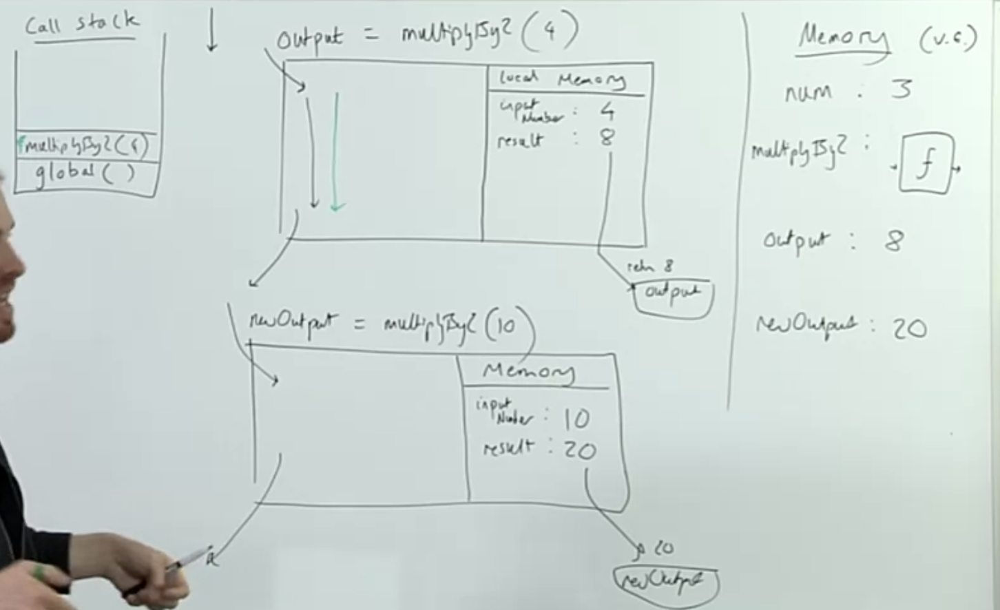
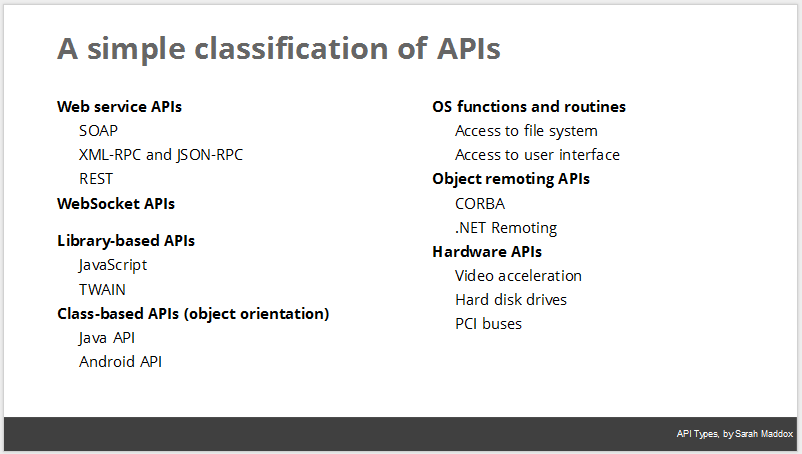
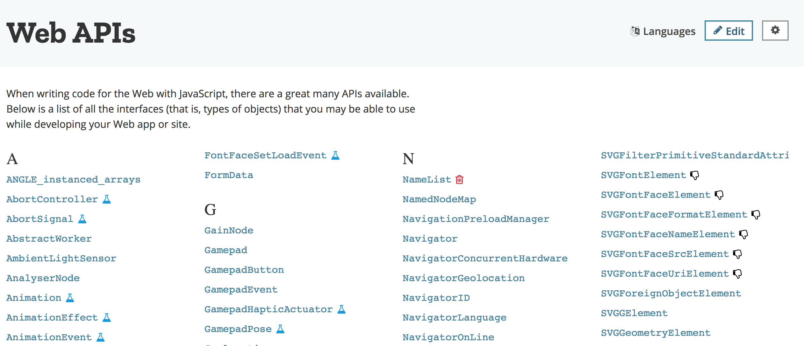
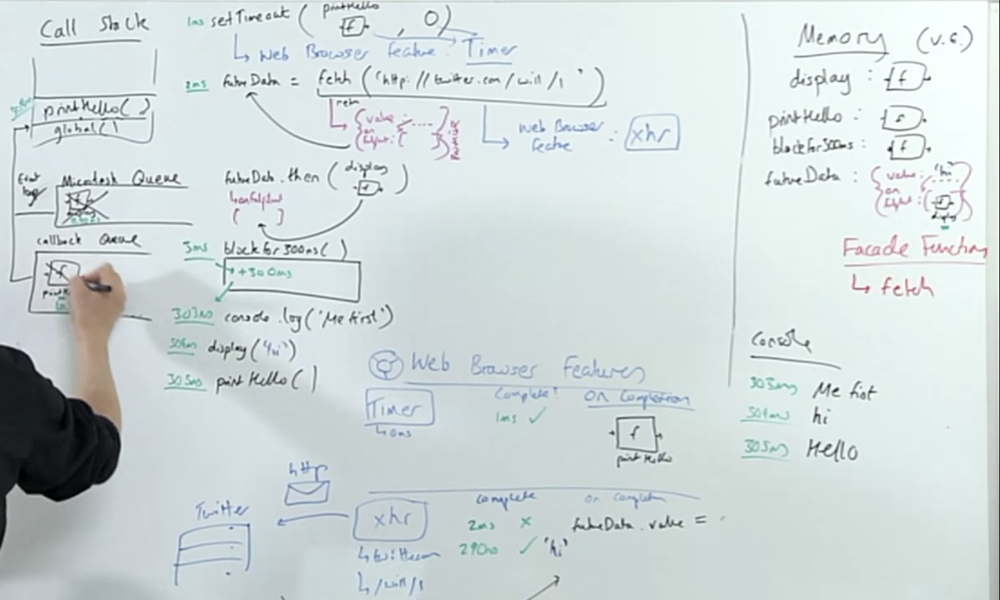

# JavaScript: The New Hard Parts

[Source](https://frontendmasters.com/courses/javascript-new-hard-parts/)

## what happens when javascript executes (runs) my code?

1. as soons as we start running our code, we create a global execution context
    + thread of execution (parsing and executing the code line after line) - from top to down
    + live memory of variables with data (known as global variable environemnt) - storing data 

```js
const num = 3
function multiplyBy2 (inputNumber) {
    const retuslt = inputNumber*2
    return result
}
const name = 'Will'
``` 
## storing stuff in memory (variable environment)
1: num - in our memory we declare a constant variable (a piece of data where we can't change it's position/replace the value)
2: multiplyBy2 - we are storing the function definition under this variable in the memory
3: name - we declare a constant variable with a value

**we are not going to execute the function, here in the code above we simply store some data in the memory.**

**Note:** declare means go save in memory a value to a variable. We simply assign a value to a variable in the memory.

* execution context = variable environment + thread of execution (a context is a space in which we execute our code)

---
```js
const num = 3
function multiplyBy2 (inputNumber) {
    const result = inputNumber*2
    return result
}
const name = 'Will'
const output = multiplyBy2(4)
const newOutput = multiplyBy2(10)
``` 

1: output - we are creating a new variable in the memory and it's `undefined` at this point. It's a command to go and run some code. It goes runs a function and gets a `return value` out of a function.

2: parameterizing of a function - when the function gets invoked first we define under variable environment which argument gets assigned to which parameter in the function above `inputNumber = 4`

3: result: we initialise the variable result and assign a value (declare) of the operation `inputNumber*2`and return the value back to the global execution context to `const output`

* when you execute a function you create a new **execution context** comprising:
    1. the thread of execution (we go through our code line by line)
    2. a local memory (variable environment) where anything defined in the function is stored

**note**: if there is no `return` statement in the function, the curly braces imply `{}` an implicit return and goes out.



## introducing async

* javascript is single threaded (one command executing at a time) and has a synchronous execution mode (each line is executed in order the code appears)

> it's not a feature of js to speed up internet, instead all of these features are sitting outside of javascript. All of these features are sitting in the browser or node.js. we are write javascript code which is essentially a facade for a bunch of features that are not in javascript but instead in the web browser. we write javascript code that interacts (interface) with stuff outside of javascript. those function such as `setTimeout()` or `fs.readFile()` are just a facade. a facade function does look like a javascript function but it's not a javascript function at all. instead these functions are just spinning up a background work. it's a facade for functionality outside of javascript.

**API:**  Put briefly, an API consists of a set of rules describing how one application can interact with another, and the mechanisms that allow such interaction to happen.




**Library-based APIs/SDKs:** a set of functions and procedures that allow the creation of applications which access the features or data of an operating system, application, or other service)

### introduction web browser apis/node background threads

* dom is a feature outside of javascript
* console is a feature outside of javascript
* localstorage is a feature outside of javascript

**note:** you can find all of these feature under web apis [here](https://developer.mozilla.org/en-US/docs/Web/API)


**note:** every feature that is not in my runtime in my own engine is something I interface with, so we call it api, we interact outside of javascript.



### solution 2 

```js
function printHello() {
    console.log('Hello')
}
setTimeout(printHello, 1000)
console.log('Me first!')
``` 

1: we are declaring a function in a memory `printHello`
2: we are calling `setTimeout(printHello, 1000)` 

**important** the `setTimeout()` function does nothing in javascript at all. instead it's a facade function for functionality happening outside of javascript in web browser. instead its going to spin up web browser feature (timer). and in web browser we are going to spin up the `setTimeout` with 1000ms as a property and condition complete = false on completion we want to invoke `printHello()`. `setTimeout()` is a facade function for a web browser feature `TIMER`. and this function is going to spin up the web browser feature timer and it takes two arguments: the time XXXms and the function that will be fired after the timer is complete. On completion we want to pass back to javascript `printHello` function and invoke it. 

* a fundamental rule for deferred functionality (or functions outside of the execution context of javascript) are only allowed to come back after the call stack is empty and finish running all my global synchronous code. You can have thousands `console.log()` you can have deferred functionality such as `setTimeout()`inside a function call etc. the deferred functions are only allowed to come back after the call stack is empty. 

* callback queue is a queue of functions that are ready to come back to the call stack, event loop is checking if the call stack is empty, is the global execution context finished running. the job of the event is loop is to say if the call stack is empty, is the global code finished executing. 

**note:** that's why we have as the first argument to the `setTimeout()` function a function that will be invoked after the timer is ready and the call stack and global execution context is finished. only then the function will be called.

```js
setTimeout(() => {
    console.log('im from the callback qeueu')
}, 1000)
``` 

* execution context = thread of execution (code line by line) + variable context (memory global/local) + call stack
 
 * event loop checks if there is something in a callback queue, is our call stack empty, is the global code finished, if yes you are allowed back on and the function that was deferred will be called.

 * event loop is a javascript engine feature!

 * in a callback queue you are not storing a function, you are referencing it's position in memory

 * anonymous functions are referening the position in global memory. the thing with the functions that they can have no names, since functions are objects, the name of the function is just a property of this object, so an anonymous function just have no property name or the name is null.

 * our response data is only available in the callback function -> callback hell. So the function will be invoked with specific arguments first argument is the error, the second argument is the data that comes back from the background process `callback(null, data)` 

 * in essence: you pass a function into a another function only for it to run much later

 ```js

const printHello = () => {
    console.log('hello')
}

 setTimeout(printHello, 0)
 ```
 * everything tells me i need to run a function `printHello` inside the `setTimeout()` function but absolutely not. im passing the function defintion only to be invoked beyond my control only in the application later. the function will be called beyond our control later. 

 * the function that you pass in `setTimeout()` will be auto-triggered from the web browser feature back in the javascript and will be called when call stack is empty and the thread has finished running all the code.

 ## intorduciton to promises

 * facade functions: known as web browser apis, feature of the web browser that we can interface with interact with from within our javascript, using this function they don't do anything in javascript.

 * special object built into javascript that get returned immediately when we make a call to a web browser api's/features (e.g.) fetch that's set up to return promises 

 * promises act as a placeholder for the data we hope to get back from the web browser feature's background work

 * we also attach the functionality we want to defer running until that backround work is done (using the built .then method)

 * promises object will automatically trigger that functionality to run
    + the value returned from the web browser feature's work (.e.g returned data from the server using fetch) will be that function's input/argument.

* the new facade functions (promises) do return an object inside the javascript and spin up a job outside of javascript at the same time. the object returned from a promise is a placeholder object known as a promise, have a property that is called value and has initally nothing, and that value is going to be automatically filled in later on when the background web browser task e.g. get data from twitter and bring it back when the background tasks finishes. its going to store in that immediately returned object on the value property the data that came back from the server. we now do two things with the facade functions:
    + we spining up a job in the web browser (background task) outside of javascript
    + we are getting an object with a placeholder value that will be filled with the data once the background job is finished. 

**note** it has a property that is called onFullfilment (hidden) that is going to have functionality that will be triggered automatically in javascript when that value gets updated.

# solution 3 - using two-pronged 'facade' functions that both initaite background web browser work and return a placeholder object (promise) immediately in javascript

```js
fuction display(data) {
    console.log(data)
}

const futureData = fetch('http://twitter.com/xxxx')
fetureData.then(display)
console.log('me first')
```
1. we declare a function that we are naming it display
2. constant name declaration futureData and for now it will be undefined
3. we are going to start running a function `fetch()` and `fetch()` is a facade function for background of javascript and web browser work. and we are hoping `fetch()` is going to return some data from twitter. `fetch()` kicks of xhr (xmlhttprequest) in the background and immediately return out an object with a property on it called value that is undefined this is where the result of the background work is going to store the data that came back. it also has a hidden property that is called `onFulfillment` its an empty array in which we can stick this functions that we want to auto-trigger when the value gets updated. we are attaching function to that array `onFulfillment` when the value gets updated. and the value gets updated when the browser feature gets back the results. 
    + one in javascript returns an object
    + one in web browser xhr (the job to speak to the internet)
        + it needs the url
        + the method GET, POST

**note:** xhr stands for XMLHttpRequest, the format of the data is XML and the protocol is http.

4. on response from xhr we are going to update the `futureData.value` with a data that we get back from http message and it's going to trigger all the functions on the `onFulfillment` array. 

### IMPORTANT TO UNDERSTAND
5. `futureData.then(display)` the `then()` method pushes functions to the property of the promise object `onFulfillment` which is an empty array. All what `then()` does is pushing the functions into the `onFulfillment` array. What we are doing here is not that we are calling the function, we simply pushing the function into the array and once the data comes back from xhr all the functions in the `onFulfillment` will be auto-triggered. 

6. we are calling the `console.log('me first!')` function.

7. Once the value comes back from twitter, it updates the value of our promise object that we have returned to `futureData` once the value has been updated, the functions in the `onFulfillment` array are auto-trigerred. Those functions were pushed there from the `then()` method. the function `display` is going to be triggered with the data parameter that we have received from the background work in this case the value from twitter `hi`. as a result we are getting `console.log('hi')`

**note:** the web browser feature sets the memory, means it assigns directly the returned value to the promise object. 

> const is the default way of storing data in javascript, but the values for primitive numbers you are not allowed to change it, since you are changing the position in memory. but for objects and arrays as long as you dont replace the entire object with a brand new one and just add properties or positions to an array. `const` says do not throw me out completely my data and replace with a brand new thing in memory. you are allowed add new properties, update the properties, add new element to an array. 

### but we need to know how our promise-deferred functionality gets back into javascript to be run

```js
function desplay(data) {console.log(data)}
function printHello() {console.log('Hello')}
function blockFor300ms() {/* block thread for 300ms long with for loop */}

setTimeout(printHello, 0)
const futureData = fetch('https://twitter.com/api/xxx')
futureData.then(display)

blockFor300ms()
// which will run first?
console.log('Me first!')
``` 

1. `display` declared in memory
2. `printHello` declared in memory
3. `blockFor300ms` declared in memory
4. `setTimeout()`invoking a facade function that triggers a background job in the web browser, that is called a  timer. the 0ms is the amount of time our background web timer will run for. after that time it will pass the function `printHello` into the callback queue. which means actually it will be immediately passed into the callback queue. 
    + note the event loop is always checking if the call stack is empty and the thread has finished to run all the code, once it's done it can push the function to the call stack. 
5. `futureData` declared in memory first with a value undefined. undefined because it needs to figure out to what the right side will evaluate too. and once the `fetch()` function has been executed 
    1. it immediately returns an promise object with a value property that is `undefined` and `onFulfillment` property what is an empty array
    2. it spins up a background job in the browser. the job is to set an xhr request to get data from twitter api. xhr is a web broser feature/api, once the data comes back from twitter api, we want to assign the data to the `futureData.value` object

**note** the returned output of running fetch is a promise object with different properties, especially two: `value = undefined` and `onFulfillment = []`

6. in order to do something when the value comes back from a background job we need to push a function that gets called, in order to do so we add `.then()` method to the promise object and this `.then(display)` method pushes the `display` function name into a property that is called `onFulfillment` basically it's an array.

7. we invoke the function `blockFor300ms()`, this function gets pushed to the call stack and now the thread is blocked for 300ms, once the function is finished it gets popped from the call stack. In the meantime the data comes back from the xhr request, which is a string `hi`, now the background job/browser feature/web api updates the value of our `futureData.value = 'hi'`, once the value has been updated, all the function `display` that is inside the `onFulfillment = ['display('hi')']` is sitting gets pushed to the MICRO TASKS QUEUE (job qeueue), which is an additional queue to the callback queue. The value will be passed as a parameter to that function.

8. we are calling `console.log('Me first!')` function

9. now the call stack is empty, the thread has finished running all the code and now the event loop can start pushing the deferred function to the call stack, we have now two things to go: `printHello` in the callback queue and `display('hi')` ready to go in the micro tasks qeueue (job qeueue). BUT THE EVENT LOOP PRIORITIZES TASKS IN THE TASK QEUEU. 

10. Since the event loop prioritizes tasks from the micro task (job qeueue), it will first take `display('hi')` once this function has been popped off from the call stack it goes and pushes `printHello` to the call stack.



**note:** in the javascript spec you can find out which tasks go into which qeueu. task queue = callback queue and micro-task queue = job queue. the event loop needs first to finish all tasks from the micro task before it can move to the callback queue. 

* promises have another property that its called `status = pending || resolved || rejected` and actually the `resolved()` triggers the `onFullfillment`  array functions to run with the value. `reject()` is going to trigger other functions from `onRejection` array and we pass them by `.catch() or .then(data, error)

### iterators

* we regularly have lists or collections or data where we want to go through each item and do something to each element

```js
const number = [4, 5, 6]

number.forEach(element => console.log(element))
``` 
* we call the live data that is stored in our application such as player values, rankings, everything that is currently there on data as STATE.

* iterators are kind of a stream of data that we are receiving and we can do whatever we want with the data, in comparison to `.forEach()` where we need to go to a static array and get the element and do something with it. iterators are more about streaming the data and `.forEach()` is more about going to a static element, grabbing a data and do something with it. With iterators you just getting your next element, instead of doing all these extra steps. instead of applying a functionality of data as of data beign given to me element by element.

* Programs store data and apply functionality to it. But there are two parts to applying functions to collections of data
    1. The process of accessing each element
    2. What we want to do to each element

* Iterators automate the accessing of each element - so we can focus on what to do to each element - and make it available to us in a smooth way.

* Imagine if we could create a function that stored numbers and each time we ran the function it would return out an element (the next one) from numbers. NOTE: It’d have to remember which
element was next up somehow

* But this would let us think of our array/list as a ‘stream’/flow of data with our function returning the next element from our ‘stream’ - this makes our code more readable and more functional
But it starts with us returning a function from another function

### functions can be returned from other functions in javascript

```js
function createNewFunction() {
    function add2 (num) {
        return num+2
    }
    return add2
}

const newFunction = createNewFunction()
const result = newFunction(3)

//6
``` 
### we want to create a function that holds both our array, the positions we are currently at in our 'stream' of elements and ha the ability to return the next element

```js
function createFunction(array) {
    let i = 0
    function inner() {
        const element = array[i]
        i++
        return element
    }
    return inner
}
const returnNextElement = createFunction([2, 3, 6])
const element1 = returnNexElement()
const element2 = returnNextElement()
```

