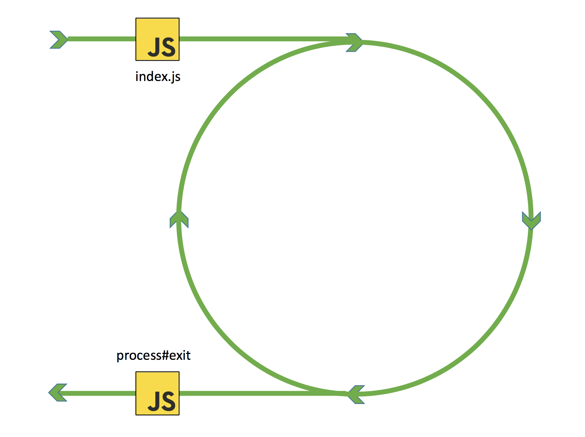
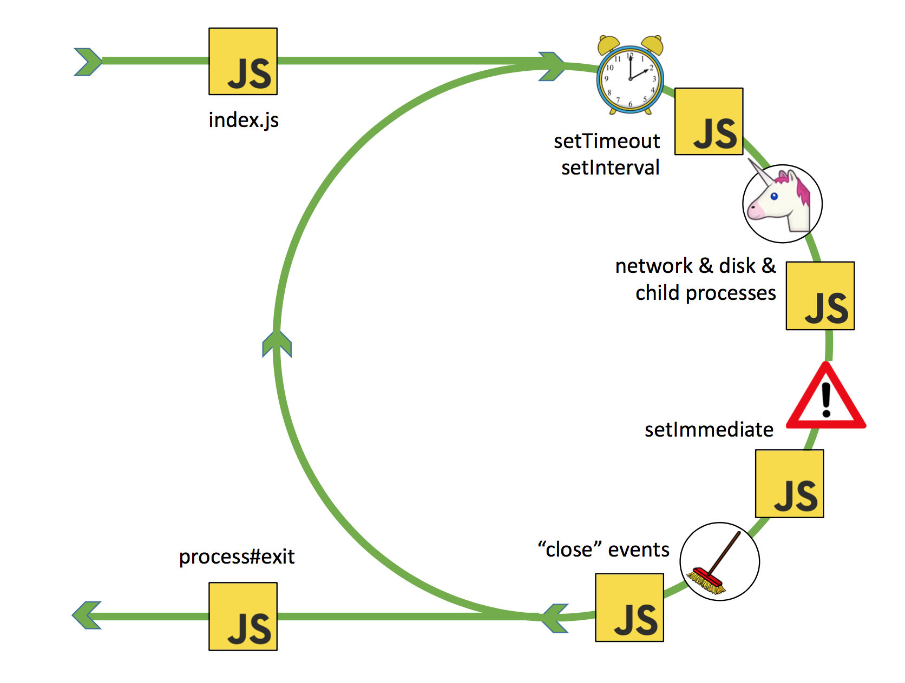
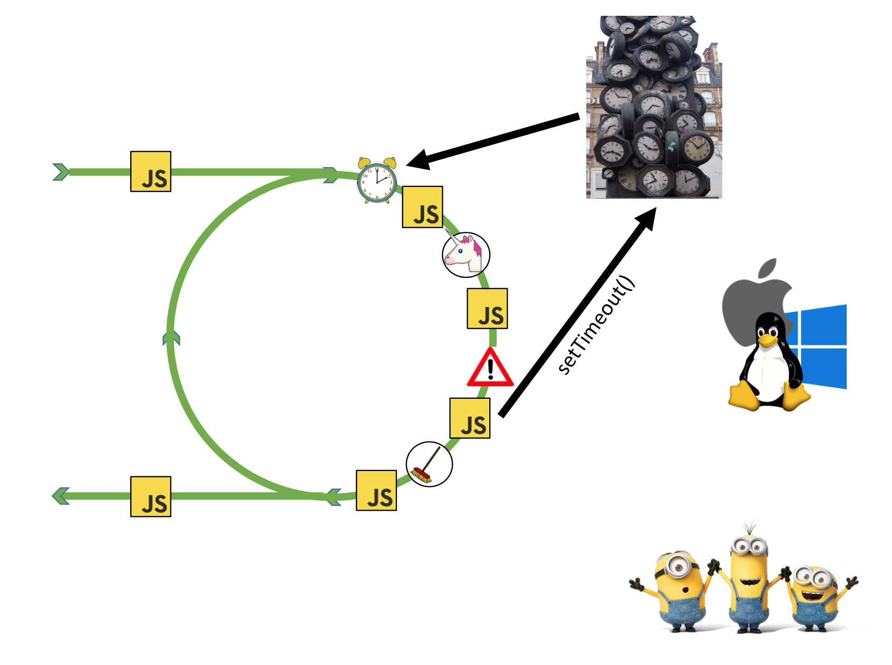
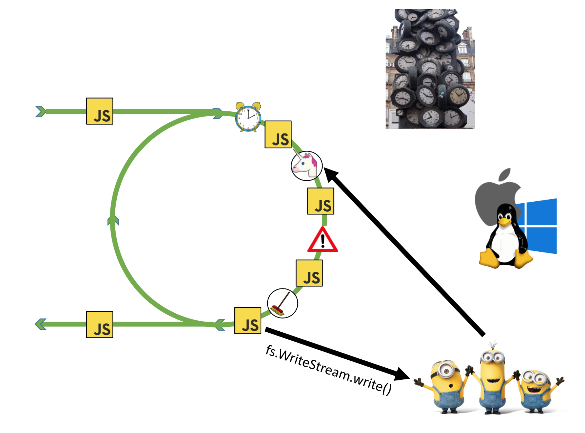
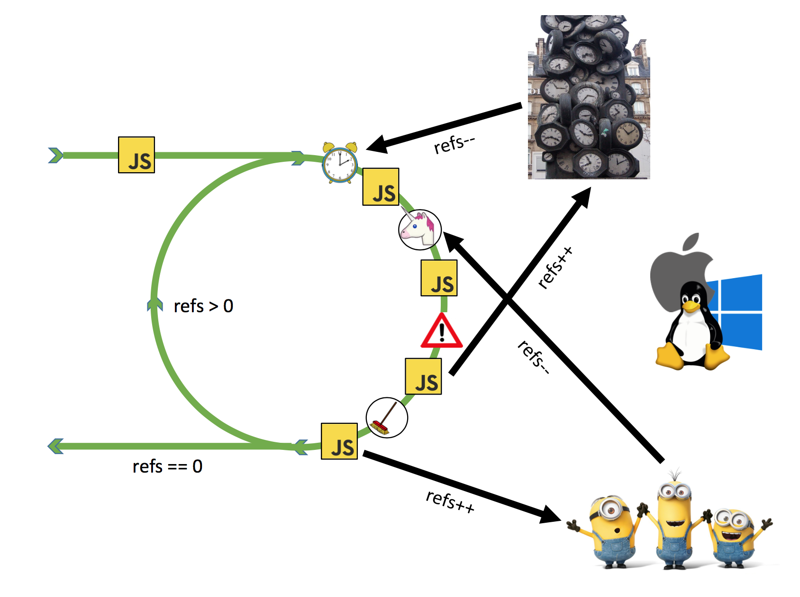
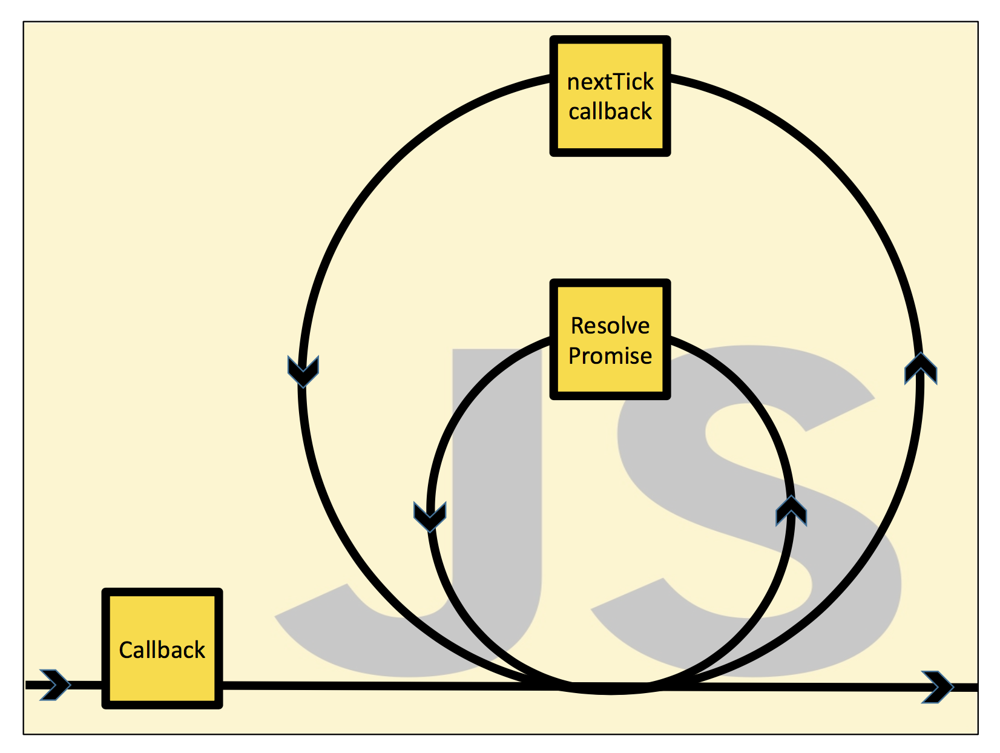

# Morning Keynote- Everything You Need to Know About Node.js Event Loop - Bert Belder, IBM



* The event loop always starts with the actual program `index.js` whatever happens if you do `npm start`

* At the very end we also know that you have this process#exit event. It’s the last thing that’s ever going to happen and since nodejs is async, you set a timer it will never fire, you try to write some data to the network it might go out but you will never know
---



* There are 4 steps that en event loop takes every iteration. 
	1. timers: this phase executes callbacks scheduled by setTimeout() and setInterval().
	2. poll: retrieve new I/O events; execute I/O related callbacks. Then there is a unicorn, but that 	does the most of the magic, if there is any disk or network 	activity going on in your process it 	will find those events there and it will call your callbacks.
	3. check: setImmediate() callbacks are invoked here.
	4. close callbacks: some close callbacks, e.g. socket.on('close', ...).


**Note:** The 4 js boxes because there is no event loop that sends things, the event loop just goes back and forth. It goes into lubuv and figures timers and call your javascript and then it figures out network events and calls your javascript and then it goes into setImmediate queue so that’s everything you did with setImmediate and at that point it will call your callbacks and finally there is this sort of internal phase where we create close events and clean up, open sockets

* At the end node decides wheter to keep running or go to that infamous process.exit() event

---



* Let’s say the javascript runs after the `setImmediate() callbacks. It calls setTimeout() what will happen internally is we compute when to set the alarm and we add it to the timer heap. By the time when the event loop gets to the little alarm spot, it will look at the timer heap figure out which one have expired call your callback

---


* The same goes for creating a server, the server is not done with the thread pool its we go directly to the opering system and asking give us notification if a new connection is made to our server and when the unicor function is trying to figure those events it will pick up the fact that there is a new connection

---



* The minions (the workers) the worker threads, there are typicall 4 not 3 and if you do something with the file system it will get a worker it will go and do it for you and then and again the unicor function will figure that out. 

---



* This is also explain how node knows where it should exit or it should just keep going. It’s simple as that everytime we send/start an operation like this file stuff that we send to the worker we add one to the reference counter and then when the callback comes, when the event happens we just subtract one. It means at this little split where we can decide either exit or we continue we can just look if the reference counter is 0 we exit otherwise we don’t 

---



* Before each phase in the event loop, the event loop goes and checks if there are some tasks in the `process.nextTick()` or in the micro-stak queue (usually promises), if there are any it will take them first and push them into the call stack of JavaScript

---

# Nodejs Event Loop

[Source](https://jsblog.insiderattack.net/promises-next-ticks-and-immediates-nodejs-event-loop-part-3-9226cbe7a6aa)

* All I/O requests will eventually generate an event of completion/failure or any other trigger,which is called an Event. These events are processed according to the following algorithm:

1. Event demultiplexer receives I/O requests and delegates these requests to the appropriate hardware.

2. Once the I/O request is processed (e.g, data from a file is available to be read, data from a socket is available to be read etc.), event demultiplexer will then add the registered callback handler for the particular action in a queue to be processed. These callbacks are called events and the queue where events are added is called the Event Queue.

3. When events are available to be processed in the event queue, they are executed sequentially in the order they were received until the queue is empty.

4. If there are no events in the event queue or the **Event Demultiplexer has no any pending requests**, the program will complete. Otherwise, the process will continue from the first step.

The program which orchestrates this entire mechanism is called the Event Loop.


**Event Loop is a single threaded and semi-infinite loop. The reason why this is called a semi-infinite loop is because this actually quits at some point when there is no more work to be done. In the developer’s perspective, this is where the program exits.**

* NodeJS has done its best to do most of the I/O using non-blocking and asynchronous hardware I/O, but for the I/O types which blocks or are complex to address, it uses the thread pool.


* Now we know that the Event Demultiplexer, is not an atomic entity, but a collection of a I/O processing APIs abstracted by the Libuv and exposed to the upper layers of NodeJS.

**Important:** If there any pending I/O requests in event demultiplexer, the program will wait until everything is finished and only then exit the execution context (or simply complete)

* Event queue is supposed to be a data structure where all the events are getting enqueued and processed by the event loop sequentially until the queue is empty. There are 4 main types of queues which are processed by native libuv event loop.

1. Expired timers and intervals queue — consists of callbacks of expired timers added using setTimeout or interval functions added using setInterval.
2. IO Events Queue — Completed IO events
3. Immediates Queue — Callbacks added using setImmediate function
4. Close Handlers Queue— Any close event handlers.

* Besides these 4 main queues, there are additionally 2 interesting queues:

1. Next Ticks Queue — Callbacks added using process.nextTick function
2. Other Microtasks Queue — Includes other microtasks such as resolved promise callbacks


* Node starts the event loop by checking for any expired timers in the timers queue, and go through each queue in each step while maintaining a reference counter of total items to be processed. 

* After processing the close handlers queue, if there are no items to be processed in any queue, the loop will exit. 

**Processing of each queue in the event loop can be considered as a phase of the event loop.**

### What’s interesting about the intermediate queues depicted in red is that, as soon as one phase is complete event loop will check these two intermediate queues for any available items.

* If there are any items available in the intermediate queues, event loop will immediately start processing them until the two immediate queues are emptied. Once they are empty, event loop will continue to the next phase.

* Next tick queue has even higher priority over the Other Micro tasks queue. You’ll notice that I have shown the next tick queue in dark red which implies that the next tick queue is emptied before starting to process resolved promises in the microtasks queue.

### Priority for next tick queue over resolved promises is only applicable for the native JS promises provided by v8. 

```js
const fs = require('fs')

const beforeNextPhase = () => {
    console.log('from next tick queue - #1')
    
}

const promiseLog = (data) => {
    console.log('from micro-task queue - #2')
}

const readfile = (data) => {
    console.log('from I/O events queue - #4')
}

fs.readFile('./file.txt', 'utf8', readfile)

setTimeout(() => {
    console.log('from timeout - #3')
}, 0)

fs.readFile('./file.txt', 'utf8', readfile)

fs.readFile('./file.txt', 'utf8', readfile)

Promise.resolve().then(promiseLog)

process.nextTick(beforeNextPhase)

//from next tick queue - #1
//from micro-task queue - #2
//from timeout - #3
//from I/O events queue - #4
//from I/O events queue - #4
//from I/O events queue - #4
``` 

**Note:** The javascript single thread goes through the thread execution context, the async tasks are distributed across different queues, the event loop picks up process.nextTick() and micro-task queue first before even it comes to the first phase with setTimeout.

* Timers Queue: When you add a timer using setTimeout or an interval using setInterval, Node will add the timer to the timers heap, which is a data structure accessed through libuv. At the timers phase of the event loop, Node will check the timers heap for expired timers/intervals and will call their callbacks respectively. 

* Although immediates queue is somewhat similar to timeouts on how it behaves, it has some of its own unique characteristics. Unlike timers which we cannot guarantee when its callback gets executed even though the timer expiration period is zero, **immediates queue is guaranteed to be processed immediately after the I/O phase of the event loop.**

**As you might guess, this program will always print setTimeout before setImmediate because the expired timer callbacks are processed before immediates. But the output of this program can never be guaranteed! If you run this program multiple times, you will get different outputs. This is because setting a timer with zero expiration time can never assure that the timer callback will be called exactly after zero seconds. Due to this reason, when the event loop starts it might not see the expired timer immediately. Then the event loop will move to the I/O phase and then to the immediates queue. Then it will see that there is an event in the immediates queue and it will process it.**

---


```js
const fs = require('fs');

fs.readFile(__filename, () => {
    setTimeout(() => {
        console.log('timeout')
    }, 0);
    setImmediate(() => {
        console.log('immediate')
    })
});
``` 

1. At the start, this program reads the current file asynchronously using fs.readFile function, and it provides a callback to be triggered after the file is read.

2. Then the event loop starts.

3. Once the file is read, it will add the event (callback to be executed) in the I/O queue in the event loop.

4. Since there are no other events to be processed, Node is waiting for any I/O event. It will then see the file read event in the I/O queue and will execute it.

5. During the execution of the callback, a timer is added to the timers heap and an immediate is added to the immediates queue.

6. Now we know that the event loop is in I/O phase. Since there are no any I/O events to be processed, event loop will move to the immediates phase where it will see the immediate callback added during the execution of file read callback.Then the immediate callback will be executed.

7. In the next turn of the event loop, it will see the expired timer and it will execute the timer callback.
---

* In the context of native promises, a promise callback is considered as a microtask and queued in a microtask queue which will be processed right after the next tick queue.

```js
Promise.resolve().then(() => console.log('promise1 resolved'));
Promise.resolve().then(() => console.log('promise2 resolved'));
Promise.resolve().then(() => {
    console.log('promise3 resolved');
    process.nextTick(() => console.log('next tick inside promise resolve handler'));
});
Promise.resolve().then(() => console.log('promise4 resolved'));
Promise.resolve().then(() => console.log('promise5 resolved'));
setImmediate(() => console.log('set immediate1'));
setImmediate(() => console.log('set immediate2'));

process.nextTick(() => console.log('next tick1'));
process.nextTick(() => console.log('next tick2'));
process.nextTick(() => console.log('next tick3'));

setTimeout(() => console.log('set timeout'), 0);
setImmediate(() => console.log('set immediate3'));
setImmediate(() => console.log('set immediate4'));
``` 

* The event loop starts checking `process.nextTick()` queue.
    1. Loop will identify that there are three items in the process.nextTick queue and Node will start processing the nextTick queue **until it is exhausted.**
    2. Then the loop will check the promises microtask queue and identify there are five items in the promises microtask queue and will start processing the queue.
    3. During the process of promises microtask queue, one item is again added to the process.nextTick queue `(‘next tick inside promise resolve handler’)`.
    4. After promises microtask queue is finished, event loop will again detect that there is one item is in the process.nextTick queue which was added during promises microtask processing. Then node will process the remaining 1 item in the nextTick queue.
    5. Enough of promises and nextTicks. There are no more microtasks left. Then the event loop moves to the first phase, which is the timers phase. At this moment it will see there is an expired timer callback in the timers queue and it will process the callback.
    6. Now that there are no more timer callbacks left, loop will wait for I/O. Since we do not have any pending I/O, the loop will then move on to process setImmediate queue. It will see that there are four items in the immediates queue and will process them until the immediate queue is exhausted.
    7. At last, loop is done with everything…Then the program gracefully exits.

**Note:** Before the event loop can move into a new phase it needs to process everything inside the event queue in which it currently is right now. E.g. if there are 10 callbacks in the I/O queue sitting, it will process all 10 callbacks before it can move to `setImmediate()` phase.

---


* Generally, any work which involves external devices except the CPU is called I/O. The most common abstract I/O types are File Operations and TCP/UDP network operations.

* JavaScript itself has no facility to perform asynchronous I/O operations. 

* As we saw in the previous NodeJS architecture diagram, libuv resides in a lower layer of the layered architecture. Now let’s look at the relationship between the upper layers of NodeJS and the phases of libuv event loop.


* As we saw in diagram 2 (Event loop in a nutshell) previously, there were 4 distinguishable phases of the event loop. But, when it comes to libuv, there are 7 distinguishable phases. They are,

1. Timers — Expired timer and interval callbacks scheduled by setTimeout and setInterval will be invoked.

2. Pending I/O callbacks — Pending Callbacks of any completed/errored I/O operation to be executed here.

3. Idle handlers — Perform some libuv internal stuff.

4. Prepare Handlers — Perform some prep-work before polling for I/O.

5. I/O Poll — Optionally wait for any I/O to complete.

6. Check handlers — Perform some post-mortem work after polling for I/O. Usually, callbacks scheduled by setImmediate will be invoked here.

7. Close handlers — Execute close handlers of any closed I/O operations (closed socket connection etc.)

* When NodeJS is initialized, it sets all setImmediate callbacks to be registered as Check handlers in libuv. This essentially means that any callback you set using setImmediate will eventually land in Libuv check handles queue which is guaranteed to be executed after I/O operations during its event loop.

---
### Event Loop Best Practices 
* Your application consists of the small components called functions. In a NodeJS application, there will be two types of functions.
    1. Synchronous Functions — Most of the time returns the outputs using return keyword (e.g, Math functions, fs.readFileSync etc.) or uses the Continuation-Passing style to return the results/perform an operation(e.g, Array prototype functions such as map, filter, reduce etc.).
    2. Asynchronous Functions — Returns the results deferred using a callback or a promise (e.g, fs.readFile, dns.resolve etc.)

**The rule of thumb is, the function you write should be:**

1. Completely synchronous — Behave synchronously for all the inputs/conditions
2. Completely asynchronous — Behave asynchronously for all the inputs/conditions.

* When the queue is empty and scheduled timers are not ready, Node.js will remain in the polling phase.

---
# The Node.js Event Loop, Timers, and process.nextTick()

* The event loop is what allows Node.js to perform non-blocking I/O operations — despite the fact that JavaScript is single-threaded — by offloading operations to the system kernel whenever possible.

* When one of these operations completes, the kernel tells Node.js so that the appropriate callback may be added to the poll queue to eventually be executed. 

* When Node.js starts, it initializes the event loop, processes the provided input script (or drops into the REPL, which is not covered in this document) which may make async API calls, schedule timers, or call process.nextTick(), then begins processing the event loop.

* The following diagram shows a simplified overview of the event loop's order of operations.

1. timers: this phase executes callbacks scheduled by setTimeout() and setInterval().

2. pending callbacks: executes I/O callbacks deferred to the next loop iteration.

3. idle, prepare: only used internally.

4. poll (incoming connectiond data etc.): retrieve new I/O events; execute I/O related callbacks (almost all with the exception of close callbacks, the ones scheduled by timers, and setImmediate()); node will block here when appropriate.

5. check: setImmediate() callbacks are invoked here.

6. close callbacks: some close callbacks, e.g. socket.on('close', ...).

**Note:** each step is referred to as a "phase" of the event loop

* Each phase has a FIFO queue of callbacks to execute. 

* when the event loop enters a given phase, it will perform any operations specific to that phase, then execute callbacks in that phase's queue until the queue has been exhausted or the maximum number of callbacks has executed.

* When the queue has been exhausted or the callback limit is reached, the event loop will move to the next phase, and so on.

* Since any of these operations may schedule more operations and new events processed in the poll phase are queued by the kernel, poll events can be queued while polling events are being processed.

# Between each run of the event loop, Node.js checks if it is waiting for any asynchronous I/O or timers and shuts down cleanly if there are not any.

---
### Some other example but not in node
[Starved Event Loop](https://gist.github.com/jesstelford/9a35d20a2aa044df8bf241e00d7bc2d0#file-event-loop-md)

---
# Node's Event Loop From the Inside Out by Sam Roberts, IBM

[Source](https://www.youtube.com/watch?v=P9csgxBgaZ8)