# Functional Programming with JavaScript

[Source](https://www.udemy.com/functional-programming-for-beginners-with-javascript/)

## Introduction

* What is an application:
1) You have a piece of **data** a tweet, a post an email = data
2) Then you have bunch of them in a **list** = list of data
3) The ability to interact with the data, retweet, liking a post, replying to an email 


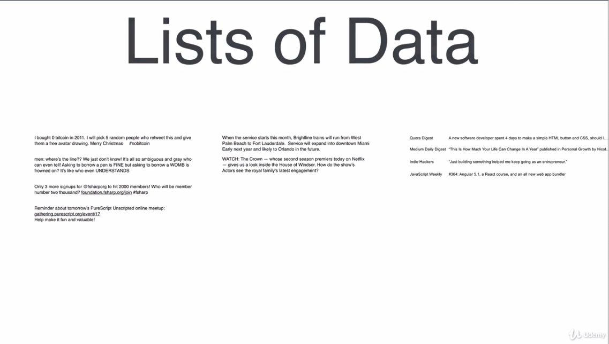
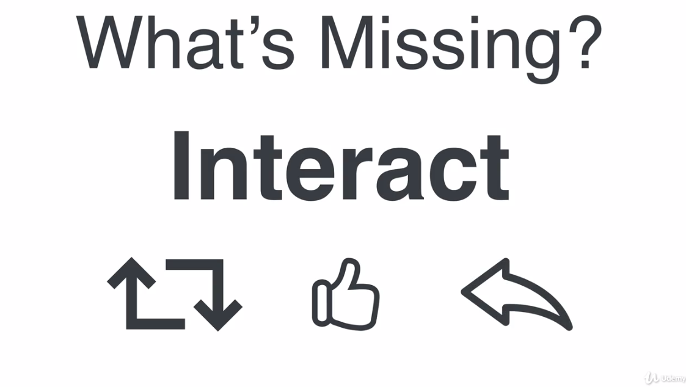

> Most apps of their core are just lists of data, but the list of raw data isn't useful by itself. You need to transform the list of data into easily consumable information that can be interacted with.

* If you want to be good at building apps, you should be good with working with:
1) Data
2) Lists of data
3) Data Transformations: transforming data into easily consumable or digestable information

* A single most skill for a seanoned programmer is knowing how to learn

* You can learn by repetion and building a lot of small apps instead of a big one

* If you want to build something:
1) keep it simple, don't be ambitious (otherwise there is chance you won't finish it)
2) keep the scope of the app small
3) after you finish your inital version, add more features to it

* The idea to learn everything asap is the wrong approach. You should concentrate yourself on the pareto rule. In JavaScript 80% of the code is written using only 20% of the JavaScript features. Concentrate yourself on the 20% of JS that is used 80% of the time. Master it! The rest that you need just learn it to know it enough.

> 1. The idea to learn everything is a wrong approach. 2. Learn 20% of JavaScript that are used 80% of the time. 3. Learn the rest case by case needed!!!


* How to find the 20% that you need to learn? Code if free, it's eassy to discover by reading and studying open source code. If you read code of a season develper is the best shortcuts you can take.

* The best way to learn the 20% is the technique called [spaced repetion](https://knowthen.com/spaced-repetition/), build small apps over and over again to repeat the concepts.
1) The brain considers a memory important, when it uses that memory more than once. And the more you use it, the more important the brain considers that memory
2) Each of us suffer from what's called the Forgetting Curve. When we're exposed to new information, our brains will gorget the new information over predictable periods of time.
3) The most efficient way of tricking the brain into remembering something for longer periods of time is to review the new infromation just before it falls out fo memory. That's why it makes not sense just to read as much as possible, but you need to repeat it to get to know it. By reviewing it just before it's forgotten, you're strengthening the memory, but the memory isn't permanent. The strengthened memory still has a forgetting curve, but this time it'll take longer to forget.

> Imagine I just showed you how to tie a knot called a clove hitch.  Then, after I showed you, I handed you the rope and asked you to tie a clove hitch knot.  There’s a good chance, you might not remember enough to tie the knot, even though you just saw it.  So imagine you forgot, then I showed you again, then I asked you to tie the clove hitch again, and this time you were able to tie the knot.  Around 24 hours from now, you’re going to forget how to tie the knot, that’s just how most minds work… so around 23 hours later I hand you a rope and ask you to tie the knot again.  Odd’s are, it would be a struggle for you to remember how to tie the knot, but you’ve got a good chance of remembering because it hasn’t been very long since you last tied the knot.  So let’s say you remembered, and were able to tie the knot.  By remembering it again, you’ve told your brain that this information is important, and you’ve reset the forgetting curve, except this time you won’t forget how to tie the knot in 24 hours, this time you’ll forget in 48 to 72 hours.  So at the 47 hour point, I hand you a rope and ask you to tie the knot again.  Odd’s are, it’s going to be a struggle, but you’ve got a pretty good chance of remembering.

* Every time you force yourself to remember how to tie the clove hitch knot, you’re strengthening your memory, and the amount of time it takes to forget is extended.  Eventually you’ll get to the point where you can just tie a clove hitch knot once every few years, and the memory is essentially fixed in your mind.

* So how can i test my memories, just before I forget them? Use Anki, which is basically a flashcard app that automatically asks you questions just before they would normally fall out of memory. Every morning spent 10 minutes, review the flashcards.
* When creating flashcards use following rules:
1) Associate new information with already known things
2) Write the flashcards in your own words

## JavaScript Basics

* JavaScript is everywhere!

* Understanding data is the most fundamental skill to any programmer

* There are couple of data types that are available to use:

* Primitive data types means it's a data type that cannot be broken into something simpler
1) String
2) Numbers - Whole number 42, Decimal Number 42.10

* Numbers and Strings are treated differently. Numbers can have different operations performed on them than strings. If you deal with a numeric value you should store it as a Number type. To perform mathematical operations such as `Match()`. Data type: A particular kind of data item (set of values), as defined by the values it can take, the programming language used, or the operations that can be performed on it.

3) Boolean can be used for dealing with states e.g. true fro show a form and false for not showing the form and instead we rather show the button.

4) undefined is another primitive type. It's usually a result of the flaws in the logic. 

* Values are mostly used in combination with a variable. What is a variable? `const calories = 180`
1) You see the keyword `const` is a short form for constant and means that the value doesn't change. Using `const` is consistent with using immutable data. For the most of your time as a functional programmer you don't use other variables such as `var, let`. `const` is the 20% of the JS that a programmer will use 80% of the time.
2) The way JS knows the data type of the variable calories is by evaluating what's on the right side of the equal sign. So in this case it sees 180 as a number type. 
> The key principle of functional programming is the idea of immutable data or data that doesn't change. 

```js
const calories = 180
const calories = '180'
console.log(calories + 1) // 181
console.log(calories + 1) // '1801' here JS converts the 1 into a String data type - coersion
```
* Take a look at the individual rows you see here in the wireframe below. Each row contains the meal description and the calories count. A row is a combination of multiple types which is a meal record. What data type should we use to combine mean and calories into a meal record?

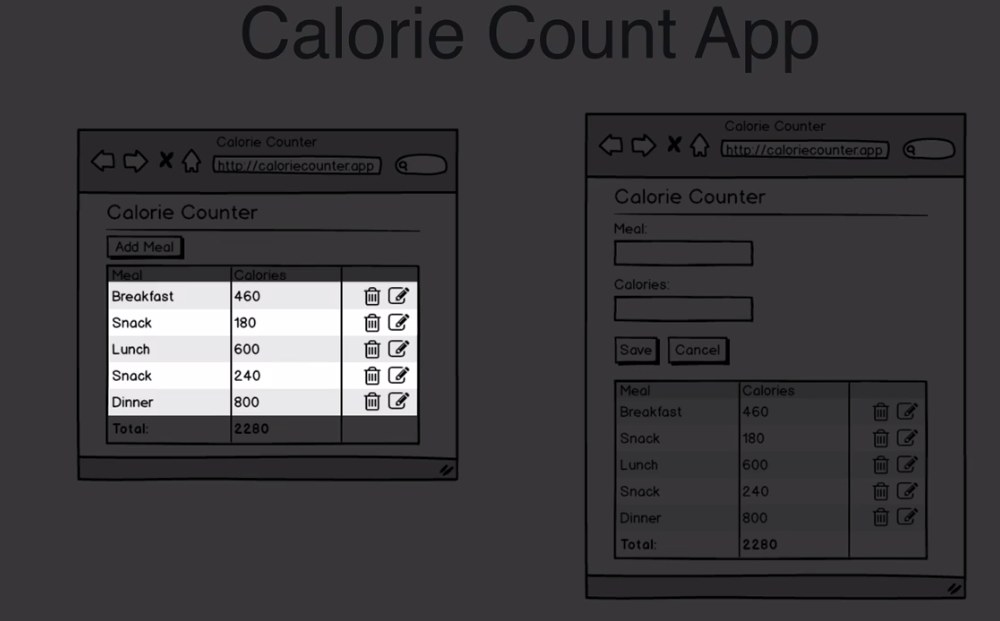

* Given the fact that meal and calories group together. We can model the data in JavaScript similarly. We should combine these two values (meal:string, calories: number) into one piece of data. The data structure that we are going to use, which is called Object Literal.

* Complex Data Types
1) Objects = Object Literal (another world we can use for it RECORD). What we call a meal is the combination of two data types: 1) description = 'Breakfast', calories = 460. To combine the data types in JavaScript we use {}. You can think of the {} as a container of other types. You use comma as a delimter properties from each other! **Object is a piece of data that groups a list of related properties to a record.**

* A basic example of creating object literals or records:
```js
const meal = {
description: 'Breakfast',
calories: 180,
}
```
2) Date is another complex data type in JavaScript.

```js
const meal = {
description: 'Breakfast',
calories: 180,
date: new Date(2008, 8, 1)
}
```

* Each row in the wireframe represents a meal record. Can be modeled in JS using Object Literal Syntax. Which data can we use that can contain a bunch of records e.g. list of meals?

3) Arrays is a data type that can contain 0 or more other data types. Arrays can be as large as needed.

```js
const meals = [
{description: 'Breakfast', calories: 460},
{description: 'Snack', calories: 220}
]
```

* An expression: a code that resolves to a value `Match.random()` or `const grade1 = 50 + Math.rendom() + 50.0`

* If statements are used to control programs flow

* Functions let you reuse code in a nice and simple way. Using the return interupts the execution of the code in the function and returning some value back to the caller (line where it was called). Functions allow you to create reusable logic or code that transforms values from one thing to another X -> Y. In the example we are transforming a percent `95%` grade to a corresponding letter `A` grade from 95% -> A. 

```js
const grade = 50 + Math.random() * 50.0
console.log(grade1)

functon letterGrade(grade) {
if (grade >= 90) {
return 'A'
{ else if (grade >= 80) {
return 'B'
} else if (grade >= 80) {
return 'C'
} else if (grade >= 60) {
return 'D'
} else {
return 'F'
}
}
``` 

## Immutable Data

* What is immutable data? It's data that never changes once it has been created!!!

* Strings are Immutable in JavaScript. When you make a string in JavaScript it will never change `Snack`. You can use this string to create another strings `'AM' + 'Snack'` but the original string never changes. 

* Avoiding mutating state is a good idea. Why? What is simpler? Immutable data or data that can be chagned? Something that never changes, such as immutable data is by defintion simpler than data that can change. 

```js
const PI = 3.14 // creates an immutable value, it can never be changed somewhere else in the codebase
````
* If a piece of data is immutable I don't worry to share that piece of the data that someone else wrote. I don't have to worry about that the code in that function will change my data. Data that doesn't change is SIMPLE. And keeping things simple when creating a software will result in less complicated code, the less complicated code have fewer bugs, easiert to test and maintain. 

> Don't confuse simple and easy. Simple isn't easy. Often it's hard, but simple software is beautiful. 

* JS doesn't support immutability. It's mostly up to you. And in JS it can be a bit misleading in particularly with the `const` keyword. With `const` you cannot mutate simple data types, but you can mutate the complex types. `const` only prevents reassignment of a value to a constant. 

* In an app we often need to make state changes. State are the things that your program often remembers. Things that happen over time where your program remembers or keeps track of. In the calorie counting app the app needs to remember:
1) When the new meals are added
2) When meals are updated
3) When meals are deleted

* Keeping track of these type of changes is refered to as a maintaining state in a program. In order to combine state and immutable data, we need to use this approach see below. It shows how to make changes to our state in a immutable way. We simply create new objects (records) and manipulate them. 

### Updating Objects in a Immutable Way

```js

// 0. INIT: Initialise state for your program
const meal = {
  description: 'Dinner',
};


// 1. ADD: In an Immutable way, add a property to the meal called calories setting it's value to 200,
const updatedMeal = {
  ...meal,
  calories: 200
}


// 2. UPDATE: In an Immutable way, increase the calories by 100 and print the result to the console
const newCalories = {
  ...updatedMeal,
  calories: 300 // has a precedence over the calories property from the updateMeal object that are we are spreading here
}


// 3. DELETE: In an Immutable way, remove the calories property and log the result to the console
const {calories, ...mealWithoutCalories} = newCalories

console.log(meal, updatedMeal, newCalories, mealWithoutCalories)

// [object Object] {
//   description: "Dinner"
// }
// [object Object] {
//   calories: 200,
//   description: "Dinner"
// }
// [object Object] {
//   calories: 300,
//   description: "Dinner"
// }
// [object Object] {
//   description: "Dinner"
// }
``` 

* When we using spread operator is what happening the properties of what we are spreading `meal` in the case above are expanded into new thing that you have created. It's like you copy the `meal` object into a new object and the curly braces where removed. Essentially the properties of an old object are injected into a new object.  Using the spread operator we can add new properts and update existing properties.

* To delete a property from an object we need to combine two operations: Destructuring + Rest Syntax `const {calories, ...mealWihtoutCalories } = newCalories`. Here we are pulling the `id` out into his own `const`, then whatever remaining properties there are in `newCalories` is collected `mealWithtouCalories` `const` 

* The `...` syntax does different things depending on where you use it. To spread something we use `...` on the right side of equal sign. The rest syntax which collected the remaining properties we use `...` on the left side of the equal sign. 

### Updating Array in a Immutable Way

* You can use the same spread `...` with Arrays too.

```js
const meals = [
  {id: 1, description: 'Breakfast', calories: 420},
  {id: 2, description: 'Lunch', calories: 520}
]

const meal = {
  id: 3,
  description: 'Snack',
  calories: 180
}

const updatedMeals = [...meals, meal]

console.log(updatedMeals)

// [[object Object] {
//   calories: 420,
//   description: "Breakfast",
//   id: 1
// }, [object Object] {
//   calories: 520,
//   description: "Lunch",
//   id: 2
// }, [object Object] {
//   calories: 180,
//   description: "Snack",
//   id: 3
// }]
``` 

* Updating an array? We can update an array by using a map function. `.map()` is a function that transforms data. The map funciton always creates a new array, it never modifies the existing array as some of the methods in JS do.

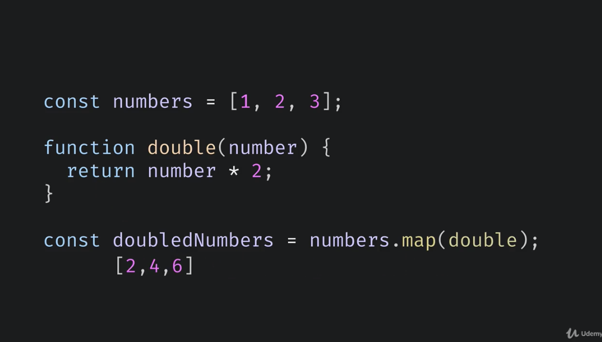

* Functions are things that transform values. Functions are values similar to how Numbers, Strings, Booleans, Object Literals. In JavaScript functions are set as to be the 1st class and they are treated just like any other value. Passing one function into another function as an argument is being another big concept, that you use extensivly as a functional programmer. 

**Note:** to update a value of property, we spread and reassign the key (name) with a new value. See example below:

```js
// 1. ADD: This is how you can add an item to an array
const meals = [
  {id: 1, description: 'Breakfast', calories: 420},
  {id: 2, description: 'Lunch', calories: 520}
]

const meal = {
  id: 3,
  description: 'Snack',
  calories: 180
}

const updatedMeals = [...meals, meal]

console.log(updatedMeals)

// 2. UPDATE: This is how you can update an item in an array
const updateDescription = (element, index, array) => {
    if (element.id === 1) {
      return {...element, description: 'Update Description'}
    } else {
      return element
    }
}

// 3. DELETE: This is how you can delete an item from an array
const updatedMealDescription = updatedMeals.map(updateDescription)

console.log(updatedMealDescription)

const filteredMeals = updatedMealDescription.filter(element => element.id !== 1)

console.log(filteredMeals)
[[object Object] {
//   calories: 420,
//   description: "Breakfast",
//   id: 1
// }, [object Object] {
//   calories: 520,
//   description: "Lunch",
//   id: 2
// }, [object Object] {
//   calories: 180,
//   description: "Snack",
//   id: 3
// }]
// [[object Object] {
//   calories: 420,
//   description: "Update Description",
//   id: 1
// }, [object Object] {
//   calories: 520,
//   description: "Lunch",
//   id: 2
// }, [object Object] {
//   calories: 180,
//   description: "Snack",
//   id: 3
// }]
// [[object Object] {
//   calories: 520,
//   description: "Lunch",
//   id: 2
// }, [object Object] {
//   calories: 180,
//   description: "Snack",
//   id: 3
// }]
```

**Important:** `map(), reduce(), filter()` always create a new array. They don't mutate the original array.

* How can you summarise information in an array? We can use the `reduce()` function. The reduce function is a powerful way of doing pretty much anything on lists of array. Here is the list of numbers `const numbers = [1, 2, 3] that we want to sum together. Adding numbers together that a type of transformation. And we typically transform our data with functions.

```js
const grades = [60, 55, 80, 90, 99, 92, 75, 72]

const total = grades.reduce((acc, curr) => {
  return acc + curr
})

const count = grades.length

const average = total / count

console.log(Math.round(average))

const letterGradeCount = grades.reduce((acc, grade) => {
    const {a = 0, b = 0, c = 0, d = 0, f = 0} = acc
    if (grade >= 90) {
      return {...acc, a: a + 1}
    } else if (grade >= 80) {
            return {...acc, b: b + 1}
    } else if (grade >= 70) {
            return {...acc, c: c + 1}
    } else if (grade >= 60) {
              return {...acc, d: d + 1}
    } else {
              return {...acc, f: f + 1}
    }
}, {})

console.log(letterGradeCount)
``` 
```js
// Functional Programming for Beginners Exercise

const reviews = [4.5, 4.0, 5.0, 2.0, 1.0, 5.0, 3.0, 4.0, 1.0, 5.0, 4.5, 3.0, 2.5, 2.0];

const countGroupedByReview = reviews.reduce(groupBy, {})

function groupBy (acc, review) {
  const count = acc[review] || 0
  return {...acc, [review]: count + 1}
}

console.log(countGroupedByReview)
```

### Currying

* Because a function in JS is just a simple value it can be passed as a function or be returned as a function.
* Higher order function is a function that either takes a function as an argument or returns a function.

```js
const friends = ['Nate', 'Jim', 'Dean']
const greet = greeting => name => `${greeting} ${name}`

const friendGreetings = friends.map(greet('Good morning'))

console.log(friendGreetings)
//["Good morning Nate", "Good morning Jim", "Good morning Dean"]
```
* `map()` is a higher order function because it takes another function as an argument.
* `greet()` is a higher order function because it returns another function.

* Closures are functions that can access and use variables that aren't directly passed in into the function, because of the placement of the function relative to the variables. 

```js
// Functional Programming for Beginners Excercise

// create the code to go from studentGrades array, 
// to studentFeedback (as shown in comments below)

const studentGrades = [ 
  {name: 'Joe', grade: 88},
  {name: 'Jen', grade: 94},
  {name: 'Steph', grade: 77},
  {name: 'Allen', grade: 60},
  {name: 'Gina', grade: 54},
];

const messages = {
      a: 'Excellent job',
  b: 'Nice Job',
  c: 'Well done',
  d: 'What happened',
  f: 'Not good'

}


const gradePoints = (points) => {
  if (points >= 90) {
    return 'a'
  } else if (points >= 80) {
    return 'b'
  } else if (points >= 70) {
    return 'c'
  } else if (points >= 60) {
    return 'd'
  } else {
    return 'f'
  }
}

const feedback = feedbackRules => student => {
  const grade = gradePoints(student.grade)
  const message = feedbackRules[grade]
  const name = student.name
  return `${message} ${name}, you got an ${grade}`
}


const studentFeedback = studentGrades.map(feedback(messages))

console.log(studentFeedback)
/*
const studentFeedback = [
  'Nice Job Joe, you got an b',
  'Excellent Job Jen, you got an a',
  'Well done Steph, you got an c',
  'What happened Allen, you got an d',
  'Not good Gina, you got an f',
]; 
*/
```
* **What is currying?** The transformation from a function with multiple arguments to a function that takes a single argument and returns a function that takes a remaining argument is what's called currying. 

```js
function(greeting, name) {
return `${greeting} ${name}`
}

// currying
functin(greeting) {
  return (name) {
  return `${greeting} ${name}`
  }
}
``` 
* **What is partial application?** Partial application is when we called greet, passing into greet `Good Morning`, `greet('Good Morning')`, you can think of partial application as specializing a function. When we pass `Good Morning` into greet, we are specializing the return function into essentially into `morningGreetingFunction`  

```js
const friends = ['Nate', 'Jim', 'Dean']
const greet = greeting => name => `${greeting} ${name}`

const friendGreetings = friends.map(greet('Good morning'))

// partial application
const morningGreetingFunction = greet('Good Morning') // -> this is partial application over curried function
morningGreetingFunction('Nate') // Good Morning Nate

// partial application
const afternoonGreet = greet('Good Afternoon') // -> this is partial application over curried function
afternoonGreet('Nate') // Good Afternoon Nate
```

* **Currying (Design)** is what you do to a function before you use a function. It's whats done while designing the code. Currying is related to creating functions. When you are currying there is an absence of data

* **Partial Application (Actual Use)** is what's done when you begin to use that function in part, by applying some of the parameters the function needs but not all of them. Partial application is what you are doing when using a currying function in part. Partial application is related to consuming or using functions with actual data.

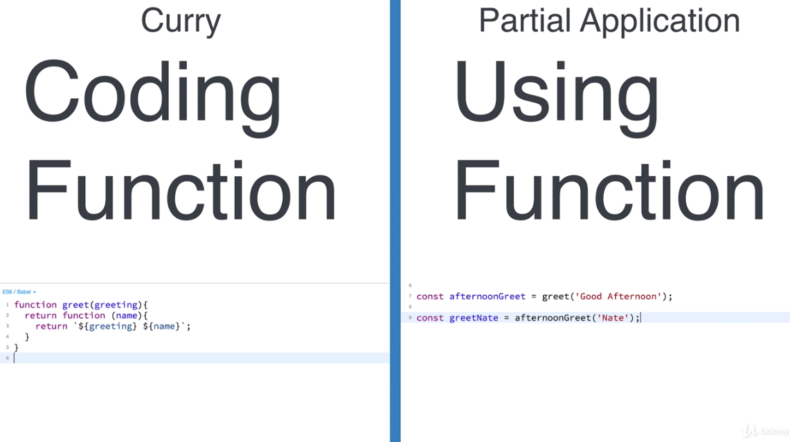

* Can you do partial application without curried function? You can have a function which performs partial application on a regular old function a non-curried function. 

```js
const add = (x, y) => x + y

// we can have a library that does the partial application
const add3 = partial(add, [3])
add3(2)
```
* You can use partial application on curried function or regular functions with helper function. 

* As functional programmer you'll be using currying and partial application all the time. Currying and partial application are those of 20% items that make 80% of your code as a functional programmer. 

* Does parameter order matters? What sequence your curried function requires the parameters? `greet` requires two parameters the `greeting` and the `name`. We ordered the parameters so that the `greeting` was first and the `name` was second. When we use `map()` we need the `name` to be the last parameter because the `name` is what the map function will be supplying. 

```js
const friends = ['Nate', 'Jim', 'Dean']
const greet = greeting => name => `${greeting} ${name}`

const friendGreetings = friends.map(greet('Good morning'))

```
* Here is the way to think about order of parameters for a curried function. Any parameter that turns a general function into more specialized function should be the first parameter. When we pass the first parameter to `const specializedGreeting = greet('Good Afternoon')` we kind specialized the function, it's `Good Afternoon` function now. 

* Another way of ordering function is, the last piece of data should be the data that your function is acting on. What does it mean the data the function acts on? `['Nate', 'Jim'].map(greet('Good Afternoon'))` In this example `greet('Good Afternoon')` is acting on the individual name that it's passed. So the name is on what's beeing acted on `greet('Good Afternoon')('Nate')`

* JavaScript doesn't support the carrying as other languages. You need to write some sort of verbose code `fn(1)('Nate')(50)('Hello')`. Therefore most of the functional programmers use libraries such as Rambda. 

```js
const greet = R.curry((greeting, name) => `${greeting} ${name}`) 

console.log(greet('Good Morning', 'James'))
// "Good Morning James"

const morningGreeting = greet('Top of the morning to ya')
console.log(morningGreeting('James'))
// "Top of the morning to ya James"
``` 
* **Apps** just present data ins meaningful and consumable way. Apps transform raw data into information. And apps allow interacting with the information. Apps are data and transformations of that data. 

#### Pure Functions

* There are pure functions and **impure functions (procedure)**. 

- **Pure Function** creates and returns value based only on the input parameters and causes no side-effects. Rules: 
1) Must have input parameters, 
2) No stateful values e.g. must not depend on any variables outside of themselves that could change over time, 
3) Must return a value that is determinant only by it input parameters `const add = (x, y) => x + y` 
4) No side effects. Side effect is when your code causes some change outside of itself. If you run a function and that function has created some permanent change, that change is a side effect `console.log()`, save something in the database, writing to a file or making changes to what's seen in a web app. 

**Impure function**

* If it breaks only 1 rule than it's an impure function.

* Should we call it a function? Must people would call it a function, probably because it's using the function keyword. But a better description for increment it's a **procedure**.

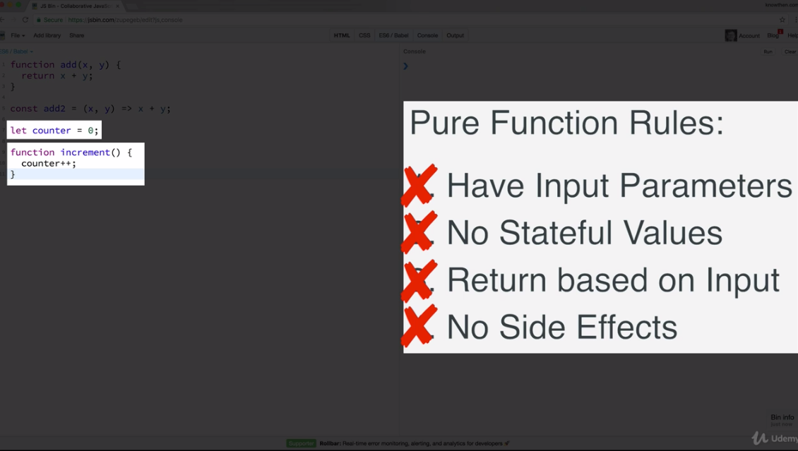

* Writing pure functions is hard. So why we should use them?
a) Pure functions are reusable
b) Pure functions are composable (you can combine functions to effectively create new functions)
c) Pure functions are easy to test, you just provide input values and you check to see the result is what you have expected. d) Pure functions always produce the same result for a given input so it's easier to cache expensive function calls

* If you always write pure functions, how do you develop applications that have state? For example when you write a todo app, how do you maintain the list of todo items? You need eliminate state as much as possible and tightly control state when it's needed. 

#### Function Composition

* Function composition is making functions out of other functions by combining the logic of other functions. 

* When the output of one pure function is the same type the expected input to another pure function, you can join them or what's called compose them. Feeding the output of one function as input to another function is what compose can be used for.

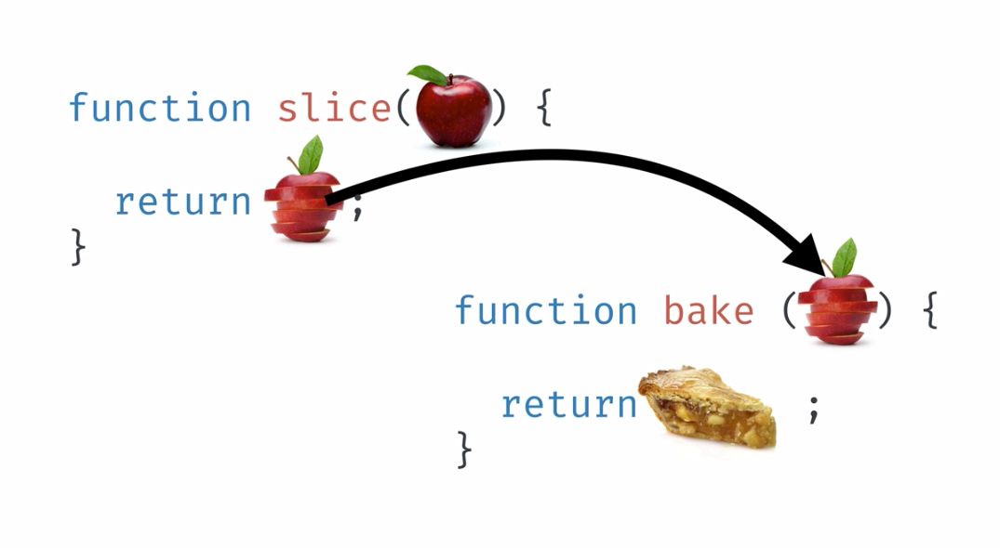
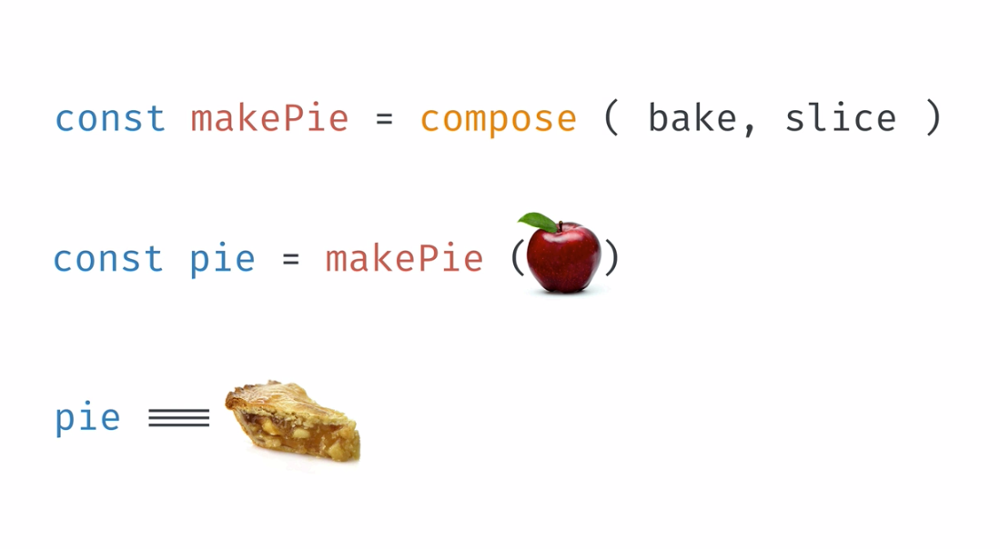

* Compose works from right to left!!!

* Pipe works from left to right!!!

```js
const sentence = 'Lorem Ipsum is simply dummy text of the printing and typesetting industry. Lorem Ipsum has been the industry'

const wordList = R.split(' ', sentence)
console.log(wordList)
// ["Lorem", "Ipsum", "is", "simply", "dummy", "text", "of", "the", "printing", "and", "typesetting", "industry.", "Lorem", "Ipsum", "has", "been", "the", "industry"]


const wordCount = R.length(wordList)

console.log(wordCount)
// 18

const countWords = R.compose(R.length, R.split)
console.log(countWords(' ', sentence))
// 18

const countWords2 = R.compose(R.length, R.split(' '))
console.log(countWords2(sentence))
// 18

const countWords3 = R.pipe(R.split(' '), R.length)
console.log(countWords3(sentence))
// 18
``` 

* An exercise for function composition

```js
const sentence = 'PechaKucha is a presentation style in which 20 slides are shown for 20 seconds each (6 minutes and 40 seconds in total).';

const getDigits = (array) => array.map(element => element.match(/\d/g))
const removeNulls = (array) => array.filter(element => element !== null)
const flattenArray = (array) => array.flat()
const numbersInString = R.compose(R.length, flattenArray, removeNulls, getDigits, R.split(' '))
expect(numbersInString(sentence)).toBe(7); 
console.log('If you see this printed in the console, the test passed!');
``` 

```js
const sentence = 'PechaKucha is a presentation style in which 20 slides are shown for 20 seconds each (6 minutes and 40 seconds in total).';

const numbersInString = R.pipe(
  R.split(''),
  R.map(parseInt),
  R.filter(Number.isInteger),
  R.length,
  );

expect(numbersInString(sentence)).toBe(7);

console.log('If you see this printed in the console, the test passed!');
```

### HTML

* What is a DOM: Document Object Model. When the browser loaded the HTML, showed it to the user (rendered) it creates the Document Object Model, which is a data structure you can interact with programmatically using JavaScript. It's helpful to see a DOM as a tree structure with a bunch of children. 

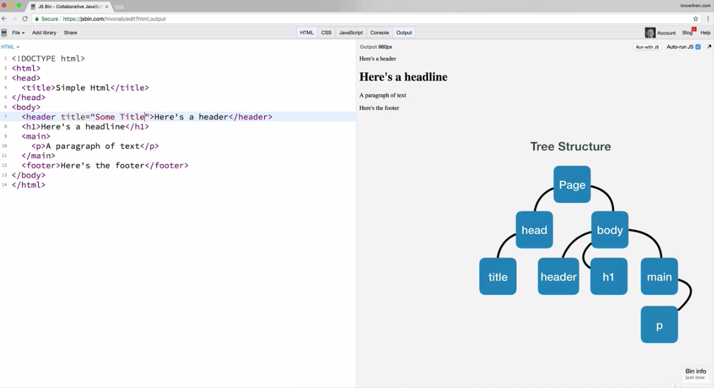

* CSS controls how content is displayed on a web page. It controls colors, fonts, margins and borders. 

* You can chain the classes in CSS see example

```html
<style type="text/css>
.f5 {
font-size: 5rem;
}
.bg-yello {
background-color: yellow;
}
</style>
             
<p class="f5 bg-yellow">Here comes the text</p>
```
#### Tachyons

* In Tachyons CSS classes do always one thing and you can compose them all together.

```html
<html>
<head>
  <meta charset="utf-8">
  <meta name="viewport" content="width=device-width">
  <title>JS Bin</title>
  <link rel="stylesheet" href="https://unpkg.com/tachyons@4.10.0/css/tachyons.min.css"/>
</head>
<body>
  <button>Save</button>
  <button class="ph3 pv2 bg-blue white bn br1 dim">Save</button>
</body>
</html>
```

* In functional programming you don't combine the data with functions. You are trying to keep your data and your functions separate as much as absolutely possible. 

1. If you look at the app, think about the underlying structure you can use. Don't think about anything else, just think about the data structure. The most obvious data structure here, would be an array with meal records. 

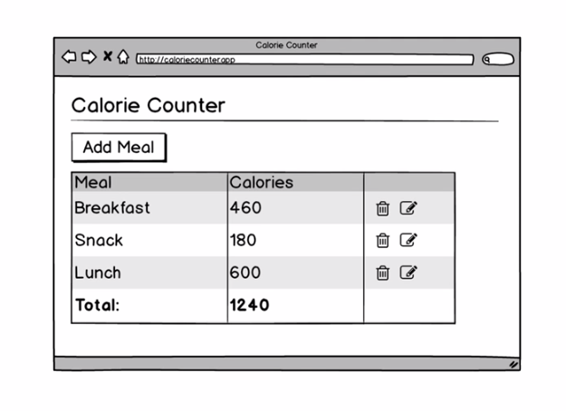
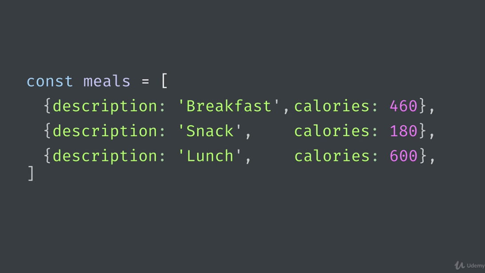

2. Start thinking about what HTML elements do you need to visualise the data structure. 

#### How do we get from raw data into HTML? How do we transform data?

* As a programmer we use functions to transform data from X -> Y. 

* To transform the raw data e.g. array of records we can apply functions. We are going to use libraries to transform the raw data into HTML data. In this case we are going to use Hyperscript + hyperscript helpers. 

* Accessing DOM with a function makes the function impure because it depends on the state from the DOM which could change from call to call. Calling `const node = document.getElementbyId('app')` or `node.appendChild(myHeading` is also impure, it does change the node. 

> As functional programmer we want to eliminate the user of side-effects as much as possible. If we can't eliminate the side-effects, we will tightly control it. 

#### Programmatically Create HTML

* We can write a function that transforms data to HTML, or we can use many functions that do the same. The rule I should follow is the single responsibility principle. **Each function should do only one thing.** In the example below each function should do only one thing.

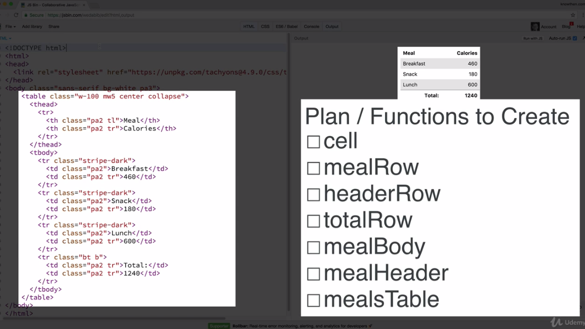
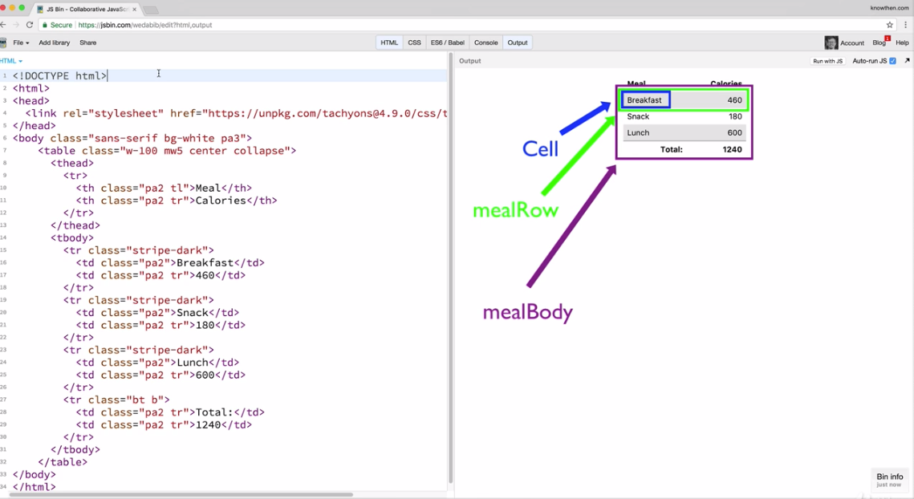

* Data model is simply the list of records as seen below.

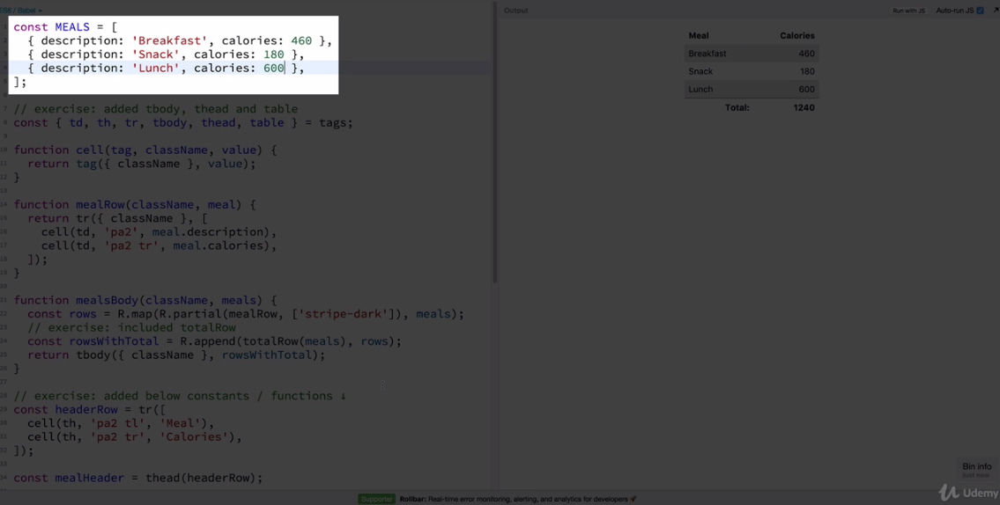

> As a functional programmer you are instered in data model (data) transforming it into something such as HTML can be accomplished by simply calling functions. You use data and use functions to transform that data!

### Declarative Programming

* Functional Programmer = Declarative style of programming. In the last exercises we turned an array of MEAL (data model) into HTML/CSS. Here you simply know the end result, such as giving the address and you can find a way to that address how you like.

* Imperative type of programmin = JQuery, you can see it as giving someone directions on how to get to your house. With JQuery you need to provide step by step instructions on how to build e.g. a HTML table. 

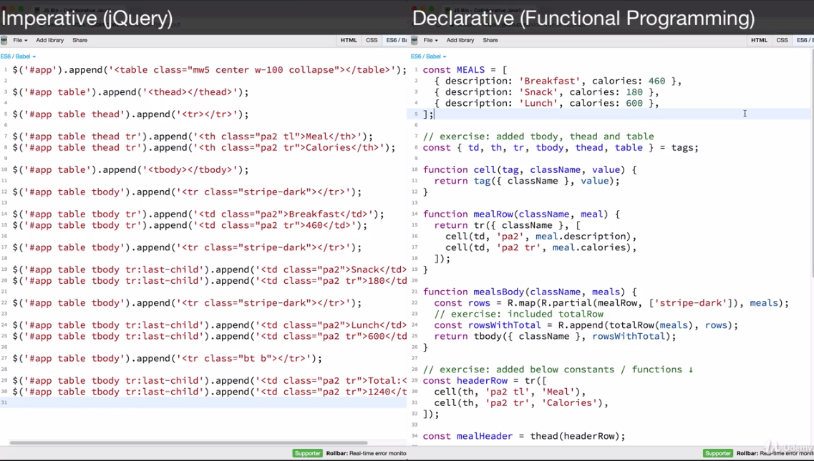

* What is functional programming? FP is a style of programming where you use pure functions almost exclusevely. Pure functions always produce the same result for a given input, they are reusalbe, they are composable, and they are easy to test. Pure functions allow for parallel execution, there is no accessing shared state. 

* How do you maintain state with pure functions. FP doesn't say you should avoid state, it says you should avoid state as much as possible and the rest that cannot be avoided should be tightly controlled or isolation/controlling of side-effects. 

> State is like radio-active materials. They should be isolated and kept controlled. Most bad bugs are state related. Eliminating and controlling state will lead to better and simpler software. 

* In functional programming data comes last!

```js
const KtoC = k => k - 273.15
const KtoF = k => k * 9 / 5 - 459.67

const updateTemperature = R.curry((convertFn, city) => {
    const temp = Math.round(convertFn(city.temp))
    return { ...city, temp }
})

// data comes last in functional programming
const updatedCitiesRamda = R.map(updateTemperature(KtoF), cities)
console.log(updatedCitiesRamda)``` 
