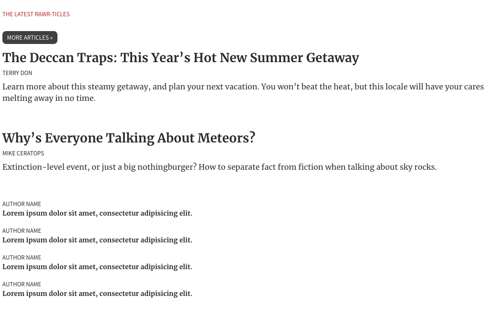
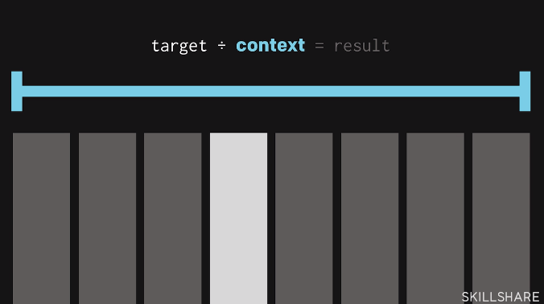
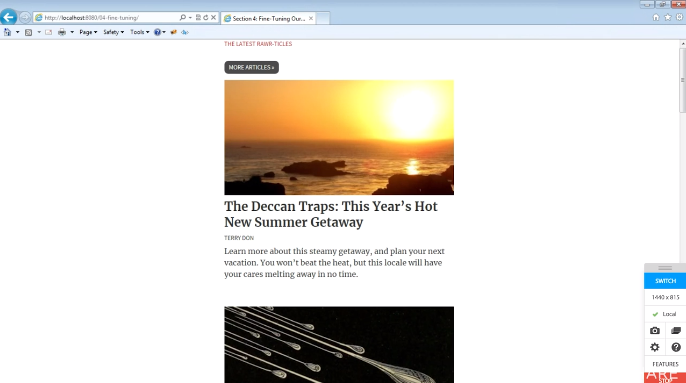

# Responsive Web Design: Creating Flexible Websites That Last

* [Video Course on Skillshare](https://www.skillshare.com/classes/Responsive-Web-Design-Creating-Flexible-Websites-That-Last/440884573/reviews)

* [Code Examples](https://github.com/tarasowski/javascript-pocketguide/tree/master/html/examples/skillshare-ethan)

* [HTML Structure Blueprint](https://github.com/tarasowski/javascript-pocketguide/blob/master/html/examples/skillshare-ethan/00-full.html) OR in [Preview in Browser](https://skillshare.ethanmarcotte.com/)

## What is responsive design?

* When we designing for the web, the web is everywhere. Web is completely flexible design medium.

> When we design for the web, we're designing for an infinite canvas. Our designs needs to be flexible as devices there are.

* When you change the size the content changes too.

* We should stop designing for individual devices, we should design for readers. The design should be flexible everywhere.

> With responsive design all devices receive the same experience. You are designing for one flexible experience. (It just might look differently)

1) Fluid grid (a layout build with percentages with proportions)
2) Flexible images
3) Media queries (create layouts that change the shape)

> A responsive layout is flexible in nature, but changes and adapts at certain breakpoints. 

## 1. Creating Fluid Grids (The foundation of responsive design)

> Every responsive design begins with a flexible foundation.

1) He analyses the structure of the content and translates it into markup. He created blocks such as `<main>`, `<section>`, `<header>`, `<article>` and so on. **Important:** No images focus on the content. 


```html
  <main class="site-content" role="main">
    <section>
        <div class="articles-recent">
            <header></header>
            <article class="story story-lead"></article>
            <article class="story story-alt"></article>
            <aside></aside>
        </div><!-- /end .articles-recent -->
    </section>
</main>
``` 
---

2) Then he applyed some simple styling to HTML elements such as colors, font-sizes. There are still no images. We don't have a layout but have some simple styles uplied to the markup from the step 1.



---

3) Now you need to x-ray the layout for the grid e.g. a 5 column grid in the example below. Now you are starting to translate your markup into a layout with CSS grids.


**Important:** Don't use pixels to translate the layout into code. But the problem with pixels is that they don't really change their shape. If you resize the browser to see how it looks on mobile, it's not going to be adapted to the screen. You can use a formula to translate something from a fixed layout into something more proportional. You can use the formula `taget / context = result`. The target is the `white box` and the `context` is the whole element. If we divide `target / context` we'll get a percentage based result `%`. So we can translate it back to get a flexible layout. In this example the entire width of the design `context` is `1000px` and the entire width of the one news element `target` is `180px`. If you divide those numbes you'll get `18%`. The `context` is the parent element where the child `target` sits in. When you change the size of the screen the relationship between the elements stays the same, means the proportions are the same as designed in px.

**Note:** You can use [Design Grid Overlay - Chrome Extention](https://chrome.google.com/webstore/detail/design-grid-overlay/kmaadknbpdklpcommafmcboghdlopmbi/related?hl=en-GB) to show grids on any website. Good for copying content.



```css

        .articles-recent {
            display: grid;
            /*  grid-template-columns: 18% 18% 18% 18% 18%; */
            grid-template-columns: repeat(5, 18%); /* 1fr would divide the grid into 5 flexible units */
            grid-column-gap: 2.5%;
        }

        /* header setting that is stretched across the full grid layout*/
        .articles-recent header {
            /*  grid-column-start: 1;
            grid-column-end: 6; */
            grid-column: 1 / 6;
        }

        /* story setting that stretches the story across 2 columns*/
        .story-lead {
            /*  grid-column-start: 1;
            grid-column-end: 3; */
            grid-column: 1 / 3;
        }

        .story-alt {
            /*  grid-column-start: 3;
            grid-column-end: 5; */
            grid-column: 3 / 5;
        }

```

---

## 2. Flexible Images

1) The author starts by adding images to the blocks `<article>`

**Note:** When images are displayed to the end user they have native dimensions. They have a `width` and a `height`. If you drop them into code without doing anything with CSS, they will be rendered at their native dimensions. They will break the layout, they are escaping the columns they are sit in. 

**Important:** If you want to make your images flexible to your desing. You should use: `img { max-width: 100% }` 

```html
<article class="story story-lead">
                

                <h2 class="hed"><a href="#">The Deccan Traps: This Year’s Hot New Summer Getaway</a></h2>
                <p class="meta"><a href="#"><cite>Terry Don</cite></a></p>
                <p>Learn more about this steamy getaway, and plan your next vacation. You won’t beat the heat, but this locale will have your cares melting away in no time.</p>
            </article>
```

2) Now you need to add one important detail to your CSS code. This says the image can render to any size whatever it wants to as long as it never wider than the element that it sits in. **The image can render at whatever size it wants to, but if that column is smaller as the image, that image is going to resize proportionally and shrink up to fit inside of that column.**

```css
img {
  max-width: 100%; /* one of the most critical tools in the responsive design toolkit */
}
```

3) If you resize the screen sometimes the images are smaller than their container, especially on bigger screens. In order to have the images everywhere equally visible you can add `width: 100%` that says that it should always match the 100% of the width of it's container. The same applies to `height: 100%`. If you want that the image convers the whole container just use `height: 100%`

```css
.story .art {
  width: 100%
}
```
---

## 3. Media Queries

> Media query is like a question we are asking a browser. If it passes that that test, yes I meet all of this conditions that you spelled out in the media query then you can conditionally apply some extra style rules just for those specific circumstances.

* In media query `min-width: 576px` means **at least** `576px` and above


* Every media query begins with the class of the media `screen, print, speech, all` and media feature `{min-width: 500px}`

```css
body {
   color: #000;
}
@media screen and ( min-width: 500px ) {
    body {
        font-size: 1.4em;
        font-weight: bold;
        color: #F00;
   }
}
``` 

* When you start to apply media queries to a flexible layout. It's very helpful to look at the areas where the design starts to breakdown and where it's starting to breakdown as the screen gets narrower. 

* In the example here we are dealing with a 5 column layout, but we want to apply this layout only if the screen-size is above a ceratin width `min-width: 960px /* or 60em */`. Now we have a media query that says above this `width: 60em` apply this grid layout. So now if we are going to size to screen to a lower than `960px` width, the design gets arranged into simple blocks, the `grid` is not applied anymore. 

```css
 @media (min-width: 35em) {
            .articles-recent {
                display: grid;
                grid-template-columns: repeat(4, 1fr);
                grid-column-gap: 2%;
            }

            .articles-recent header {
                grid-column: 1 / -1;
                /* start at 1 and end at negative -1 to span it across the whole row */
            }

            .articles-recent .story {
                grid-column-end: span 2;
            }
        }

        @media (min-width: 35em) and (max-width: 60em) {

            .articles-recent aside,
            .articles-recent .teaser-list {
                display: contents;
                /* turns the list into a grid */
            }
        }

        @media (min-width: 60em) {
            .articles-recent {
                /* display: grid; ::: we can remove it here because it's already declared in the media query above*/
                grid-template-columns: repeat(5, 1fr);
                grid-column-gap: 2.5%;
            }

            .articles-recent header {
                grid-column: 1 / -1;
            }

            .story-lead {
                grid-column: 1 / 3;
            }

            .story-alt {
                grid-column-start: 3;
                grid-column-end: 5;
            }

            .story .art {
                width: 100%;
            }

            .articles-recent aside {
                grid-column-start: 5;
            }
        }
```


> As the screen gets wider and wider we adding more layers of complexity. 

---

## 4. Fine-Tuning Your Design

> We should also optimize our typogrophy, that we are not serving wide-screen typography to small screen users.

```css
Letter from the editors

*/
.hed-letter {
    font-size: 1.75em;        /* 28 / 16 */
}
@media ( min-width: 35em ) {
    .hed-letter {
        font-size: 2.75em;    /* 44 / 16 */
    }
}
/*

Cover story

*/
.blurb {
    padding: 1.5em;
}
.blurb .hed {
    font-size: 1.5em;    /* 40/16 */
}
.blurb p {
    font-size: 1.25em;    /* 20/16 */
}
@media ( min-width: 30em ) {
    .blurb {
        padding: 2em;
    }
    .blurb .hed {
        font-size: 2em;    /* 40/16 */
    }
}
@media ( min-width: 40em ) {
    .blurb {
        padding: 3em;
    }
    .blurb .hed {
        font-size: 2.5em;    /* 40/16 */
    }
    .blurb p {
        font-size: 1.5em;    /* 24/16 */
    }
}
```

* Feature query allows us to ask a browser if it supports specific features. By asking the browser we can supply a fallback layout that is written with floats, flexbox etc. **For browsers that don't understand `grid` we should serve a single column layout and for browsers that do support `grid` w should serve the full `grid` layout**

1) We set a standard body size to 30em = 480px and margin in order to center the content
2) We add check if the browser supports `@support (display:grid) {}` 
3) If so, we reset the setting of the body `max-width: inherit;`

```css
body {
    background: #FFF;
    color: #333;
    font: normal 1em/1.5, serif;
    margin: 0 auto;
    max-width: 30em;
}

@supports (display: grid) {
    body {
        margin: 0;
        max-width: inherit;
    }
}
```
**Note:** Particularly we force browsers that don't support `css grid` to use the mobile mode, which is a no grid layout.



* You can server different images to different devices, other formats, higher definition images on higher quality display etc. For that reason you can use the `<picture>` element. 

```html
<picture>
                    <source srcset="img/logo.svg" type="image/svg+xml" />
                     <!-- fallback for browsers that don't support svg -->
                </picture>
```
---

## Final Markup / Structure 

```html
<body class="pg-full has-bg">

<header class="site-mast" role="banner">
    <div class="site-header">
        <h1 class="hed-site-logo"></h1>
        <nav class="nav-site" role="navigation"></nav>
    </div><!-- /end .site-header -->
</header>

<main class="site-content" role="main">
    <section>
        <div class="home-intro">
        </div><!-- /end .home-intro -->
    </section>

    <section>
        <div class="articles-recent">
            <header></header>
            <article class="story story-lead"></article>
            <article class="story story-alt"></article>
            <aside></aside>
        </div><!-- /end .articles-recent -->
    </section>

    <section>
        <div class="cover-story">
            <header></header>
            <div class="cover-splash">
                <div class="intro-blur" role="presentation"></div>
                <div class="blurb"></div>
            </div>
        </div><!-- /end .cover-story -->
    </section>

    <section>
        <div class="reviews-recent">
            <header></header>
            <div class="review-intro">
            </div><!-- /end .reviews-intro -->
            <a class="review" href="#"></a>
        </div>
    </section>

    <section>
        <div class="editor-letter">
            <div class="letter-content">
            </div><!-- /end .letter-content -->
            <aside></aside>
        </div>
    </section>
</main>

<footer>
    <div class="site-footer">
        <div class="info"></div>
    </div><!-- /end .site-footer -->
</footer>

</body>

```
