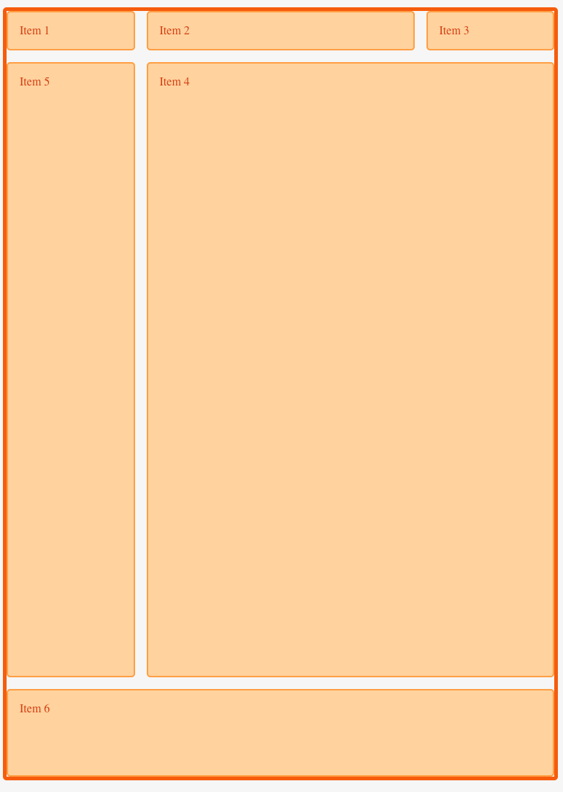

# Grids

[Source](https://scrimba.com/p/pWqLHa/cpwZkCW)

```css
.container {
    display: grid;
    grid-template-columns: 100px auto 100px;
    grid-template-rows: 50px 50px;
    grid-gap: 3px;
}
```

* Fraction unit `fr`. If we set fraction unit all columns are equal and are completely responsive. They all grow and shrink equally. The grid is divided into 3 equal fraction units. 

```css
.container {
    display: grid;
    grid-template-columns: 1fr 1fr 1fr;
    grid-template-rows: 50px 50px;
    grid-gap: 3px;
}
```

* Use `repeat` to create automatically your grid

```css
grid-template-columns: repeat(3, 1fr); /* another way to define the columns */
grid-template-rows: repeat(2, 50px);
```

* An alternative way to write it

```css
grid-template: repeat(2, 50px) / repeat(3, 1fr) /* think of it like drawing an L start with rows and then with columns */
``` 

### Positioning items

* In this example we have only 2 columns, but why the `.header` goes from 1 to 3? Well, because the first column line starts in the begining, the second column line separates the first column from the second and the third column line that goes from top to bottom at the right hand side of the grid. [Rewatch](https://scrimba.com/p/pWqLHa/cbVn4t4)

> If you have two columns, you have three column lines and you can write that like in the example below 

```css
.header {
    grid-column-start: 1;
    grid-column-end: 3;
}

```

```css
.container {
    display: grid;
    grid-gap: 3px;
    grid-template-columns: repeat(2, 1fr);
    grid-template-rows: 40px 200px 40px;
}

.header {
  grid-column-start: 1; 
  grid-column-end: 3;
  grid-column: 1 / 3; /* start line / end line */
  grid-column: 1 / span 2; /* start at the first column line and span across 2 columns */
  grid-column: 1 / -1; /* the minus one will target the very last column line, that will make it flexible */
}
```

* To be very flexible with the grids, the author proposes to use `12 columns`. They boxes within the grid will take as much space in a column as needed in order to place all the content they have inside.

```css
.container {
    display: grid;
    grid-gap: 3px;
    grid-template-columns: repeat(12, 1fr);
    grid-template-rows: 40px 200px 40px;
}
```

## Template Areas with CSS Grids

```html
<!-- Learn about this code on MDN: https://developer.mozilla.org/en-US/docs/Web/CSS/CSS_Grid_Layout/Box_Alignment_in_CSS_Grid_Layout -->

<div class="wrapper">
  <div class="item1">Item 1</div>
  <div class="item2">Item 2</div>
  <div class="item3">Item 3</div>
  <div class="item4">Item 4</div>
  <div class="item5">Item 5</div>
  <div class="item6">Item 6</div>
</div>

```


```css
* {box-sizing: border-box;}


.wrapper {
  display: block;
  border: 5px solid #f76707;
  border-radius: 5px;
  
}

.wrapper div {
  border: 2px solid #ffa8a8;
    color: #d9480f
}

@media (min-width: 35em) {


.wrapper {
    border: 5px solid #f76707;
    border-radius: 5px;
}

.wrapper > div {
    border: 2px solid #ffa94d;
    border-radius: 5px;
    background-color: #ffd8a8;
    padding: 1em;
    color: #d9480f;
}
.wrapper {
  display: grid;
  grid-template-columns: repeat(8, 1fr);
  grid-gap: 1rem;
  grid-template-areas: 
    "a a b b b b c c"
    "menu menu content content content content content content "
    "footer footer footer footer footer footer footer footer"
    
}
.item1 {
  grid-area: a;
}
.item2 {
  grid-area: b;

}
.item3 {
  grid-area: c;
}

  .item4 {
    grid-area: content;
    height: 70vh;
  }
  .item5 {
    grid-area: menu;
    height: 70vh;
  }
  .item6 {
    grid-area: footer;
    height: 10vh
  }
  
  }

```



**Note:** You can make the grid repsonsive by setting the `height: 100%` of the container / wrapper itself. Alternatively you can use `height: 100vh`. Combined if you set the `grid-template-rows: 40px auto 40px`the middle block will take the available height.

```css
.container {
    height: 100%;
    display: grid;
    grid-gap: 3px;
    grid-template-columns: repeat(12, 1fr);
    grid-template-rows: 40px auto 40px;
}
```

* You can use `.` dots which will result in blank cells. 

```css
.container {
    height: 100%;
    display: grid;
    grid-gap: 3px;
    grid-template-columns: repeat(12, 1fr);
    grid-template-rows: 40px auto 40px;
    grid-template-areas: 
        ". h h h h h h h h h h ."
        "m c c c c c c c c c c c"
        ". f f f f f f f f f f .";
}
```

**Note:** Use `margin-left: auto` to push an element to an end of the flex-box

```css
.flexbox-header {
    display: flex;
}

.flexbox-header > div:nth-child(3) {
    margin-left: auto;
}
```


