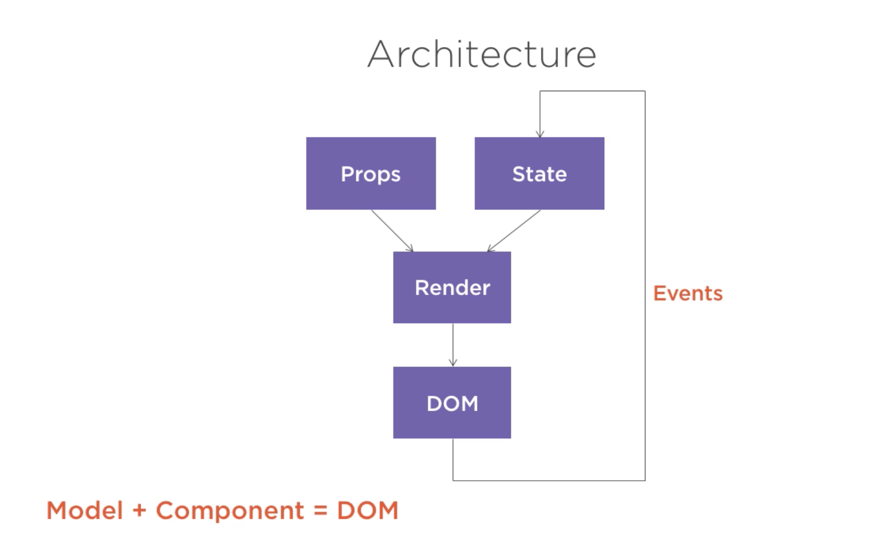

# React.js: Getting Started

[Source](https://app.pluralsight.com/library/courses/react-js-getting-started/table-of-contents)

* React is JS library and not a framework. React is small and not a complete solution, we often need to use more libs to use with React. It focuses only on UI. 

* React is building UI's. React is declarative, we describe UI's and tell it what we want not how to do it. React will take of the how and translate the declarative description. 

* 3 main design concepts:

1. Component: we desribe user interfaces using components. Components are simple functions. Input / output. We call the input properties and state and the component's output is the description of the the user interface. We can reuse components and components can contain other components. A component can hold a private state. 

2. Reactive updates: when the state of the component (the input) changes the user interface that presents the output changes as well. Since the components act as a function. React will simply react to the changes and update the output.

3. Virtual views in memory: Write HTML in Javascript. Virtual DOM. React writes only the difference to DOM. Not renders the whole DOM.

* React component can be a function or class component. 

1. A function component: It receives an object with properties. It's called props in react and returns what looks like an HTML, but it's JSX
```jsx
const MyComponent = (props) => {
    return (<elementOrComponent />)
}
```

2. A class component: is more featured way to define a React component. It also acts like a function that receives props, but that function also has a private state (STATE) as additional input that returns JSX. This private internal state is what gives react this reactive nature. If a class component changes react will automatically re-render that component. 

```jsx
class MyComponent extends React.Component {
    render() {
        return (<elementOrComponent />)
    }
}
```

* Note: State and props have one important difference. State can be changed, while props are all fixed values. Class components can change only their internal state not their properties. 

* Props is an object that holds all the values when the component was rendered. Component properties are immutable. The example below is a function component, function component cannot have state. 

```jsx
const Button = (props) => {
return (<button>{props.label}</button>)
}

ReactDOM.render(<Button label= 'Hello'/>, mountNode)
``` 

* The `render()` function returns the component (JSX).


* In the example below the `this` refers to the component itself. 
```jsx

class Button extends React.Component {
constructor (props) {
super(props)
this.state = {counter: 19}
}
render() {
	return (<button>{this.state.counter}</button>)
}
}

ReactDOM.render(<Button />, mountNode)
``` 

* The state of the component can be only accessed by that component itself. No other component can access the state of the component. In order to make it accesssible we need to hold both components together. 

```jsx

class Button extends React.Component {
//state = {counter: 0}
handleClick = () => {
	this.props.onClickFunction(this.props.incrementValue)
}
render() {
	return (<button onClick={this.handleClick}>
  +{this.props.incrementValue}
  </button>)
}
}

const Result = (props) => {
return (
	<div>{props.counter}</div>
)
}

class App extends React.Component {
state = {counter: 0}
incrementCounter = (incrementValue) => {
	// this === component instance
  this.setState((prevState) => ({
  	counter: prevState.counter + incrementValue
  }))
}
render() {
	return (
  <div>
  <Button incrementValue={1} onClickFunction={this.incrementCounter}/>
  <Button incrementValue={5} onClickFunction={this.incrementCounter}/>
  <Button incrementValue={10} onClickFunction={this.incrementCounter}/>
  <Button incrementValue={100} onClickFunction={this.incrementCounter}/>
  <Result counter={this.state.counter}/>
  </div>
  )
}
}

ReactDOM.render(<App />, mountNode)

``` 

**Note:** Rendering is the convertion of data that describes the state of the user interface into document object model object that the browser can use to produce a user interface that the user can see and interact with. 

**Note:** Event handling lets the programmer detect when the user interacts with their program and to specify how the program should response.

* A react component is a function that converts a model object into a piece of user interace. 

* React is a library and not a framework. To build complex applications you will likely need to add a router, managing state changes, validation, form support etc. You can assemble a system you want!

* As much as possible you should use component that don’t have state. Because they are simple. The flow of data always in the same direction from the model to the render to the DOM. The DOM is the direct result of rendering: Model + Component = DOM

* The way to change the DOM, you need to change the model (data). Once the DOM has been rendered it can generate events which feeds back into the component state that triggers another render cycle

* For any state change react will regenerate the component and child components. It will update the virtual DOM and regenerate the real DOM



