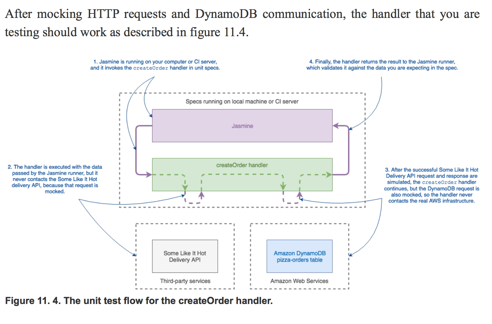

# ClaudiaJS - Testing

[Serverless Apps with Node and Claudia.js](https://www.manning.com/books/serverless-apps-with-node-and-claudiajs)

There are many more types of automated tests. These are often grouped into three layers based on their approach, from bottom to top:

* Unit layer — tests that check the small (unit) application code pieces, such as single functions
* Service layer — tests that check how those small code pieces work together, in integration; also called integration tests
* UI layer — tests that check the complete application behavior from the UI perspective

**Note:** Test cases with a failure and see how the application response to the errors and what actually the output is.

The following step-by-step approach can help you remember those cases while writing tests. Some of you might be using it in a different form already:

1. List all the different concerns. A concern represents a single function or a single piece of code responsible for one operation. In our example case, that might be calculating the discount for a pizza order.
2. Test each concern separately.
3. Look at how these concerns are working (integrating) with each other. It’s like checking how a discounted price affects the amount you’re charging the customer credit card.
4. Test each of their integrations separately too.
5. List all the end-to-end workflows. An end-to-end workflow represents one complete feature workflow available within your application. An example of this is loading your site, listing pizzas, choosing one, ordering it, and paying for it. Listing all the workflows will give you a better and more complete overview of the application.
6. Test each of the defined end-to-end workflows.

Spec is basically a JavaScript function that defines what a piece of your application should do. Specs are grouped in suites, which allow you to organize your specs. For example, if you are testing a form, you can have a validation suite, in which you’ll group all specs related to form validation.

**Use case for testing API**
Your describe block should contain multiple specs. For a simple function, such as the
getPizzas handler, you should test the following:

1. Getting a list of all pizzas
2. Getting a single pizza by ID
3. An error for getting a pizza with an undefined ID:  For example, you should pass some edge cases such as numbers smaller and larger than the existing IDs, but you should also try to test some other values, such as strings or even other types.

## Mocking your serverless functions

Mocking, primarily used in unit testing, refers to creating objects that simulate the behavior of real objects. Replacing the external objects and functions the handler under test interacts with with mocks allows you to isolate the behavior of the handler.

Let’s try testing a more complex handler, such as createOrder. There are two things that require mocking in the createOrder handler:

1. The obvious functionality to mock is the HTTP request, because you don’t want to
contact the Some Like It Hot Delivery API from your specs. Some Like It Hot Delivery API is an external dependency that you don’t own, and you don’t have access
to a test version. Any delivery request that you make in your tests can cause real-world production issues.
2. You also want to mock the DynamoDB DocumentClient, because you want to
isolate the test of the getPizzas handler from any dependency. If you test the fully
integrated handler, you would need to set up a test database to simply test handler
validation.

